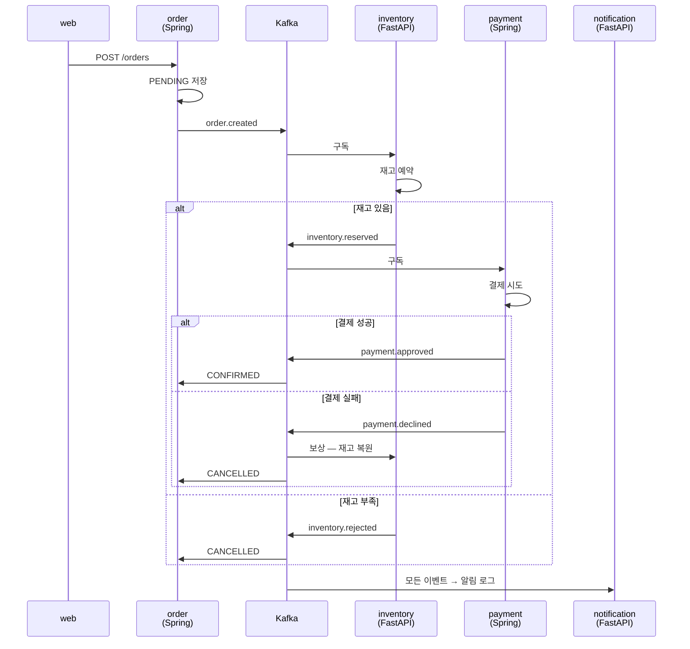

# 데모 애플리케이션 — 주문 사가

**앱 자체가 목적이 아니다.** 쿠버네티스 패턴을 전부 꺼내기 위한 **최소한의 현실적인 앱**이다.
코드는 각 서비스마다 100줄 안팎으로 유지한다.

## 도메인

주문이 들어오면 재고를 예약하고 결제한다. 어느 한쪽이 실패하면 **되돌린다.**



**분산 트랜잭션을 2단계 커밋 없이 처리한다.** 각 서비스는 자기 DB만 다루고,
실패하면 앞 단계가 **보상 이벤트**를 받아 되돌린다. 최종 일관성이다.

## 바운디드 컨텍스트

| BC | 스택 | 저장소 | 역할 | 배포 |
|---|---|---|---|---|
| [**inventory**](inventory/) | FastAPI | 메모리 → MySQL | 재고 예약·복원 | Stage 4 |
| [**order**](order/) | Spring Boot | H2 → MySQL | 주문 상태 관리 | Stage 5 |
| [**payment**](payment/) | Spring Boot 4 | H2 → MySQL | 결제 승인·취소, **멱등성** | Stage 6 |
| [**notification**](notification/) | FastAPI | — | 이벤트 구독, 알림 로그 | Stage 6 |
| [**web**](web/) | Next 16 | — | 주문 UI | Stage 6 |

**코드는 전부 미리 만들어 뒀다.** 앱 작성이 목적이 아니므로
단계마다 코드를 새로 쓰느라 흐름이 끊기지 않게 했다.
각 단계는 **무엇을 배포하고 무엇을 연결하는가**만 다룬다.

### 단계가 진행돼도 이미지는 그대로다

모든 서비스가 **환경변수로 동작을 바꾼다.**

| 변수 | 없을 때 | 있을 때 |
|---|---|---|
| `DATASOURCE_URL` | 메모리 H2 (Spring) | MySQL |
| `DATABASE_URL` | 메모리 dict (FastAPI) | MySQL |
| `KAFKA_BOOTSTRAP` | 로그만 남김 | 실제 발행·구독 |

Stage 4 는 아무것도 주지 않고 띄우고, Stage 5 에서 DB 를, Stage 6 에서 Kafka 를 붙인다.
**이미지를 다시 빌드하지 않는다** — 12-factor 의 설정 분리를 그대로 따른 것이고,
"설정만 바꿔 배포한다"가 무슨 뜻인지 직접 확인하게 된다.

### 스택을 나눈 기준

**Spring** — 트랜잭션과 상태가 무거운 쪽(`order`, `payment`).
JPA, Outbox 패턴, 트랜잭션 경계가 중요한 영역이다.

**FastAPI** — 가볍고 빠른 쪽(`inventory`, `notification`).
이미지가 작고 기동이 1초라 반복 배포 실습에 유리하다.

> **Stage 4는 `inventory`(FastAPI)로 시작한다.**
> 첫 단계의 목적은 "이미지 빌드 → 푸시 → 배포" 루프를 익히는 것이라
> 빌드가 빠른 쪽이 맞다. Spring 은 JVM 기동·메모리 특성을 다룰
> Stage 6 에서 들어온다 — `startupProbe` 가 왜 필요한지도 그때 체감된다.

## 이벤트 계약

토픽은 `<도메인>.<사건>` 형식. 모든 이벤트에 `eventId`, `occurredAt`, `orderId` 를 담는다.

| 토픽 | 발행 | 구독 | 의미 |
|---|---|---|---|
| `order.created` | order | inventory, notification | 주문 생성됨 |
| `inventory.reserved` | inventory | payment, order, notification | 재고 예약됨 |
| `inventory.rejected` | inventory | order, notification | 재고 부족 |
| `inventory.released` | inventory | notification | 재고 복원됨 (보상) |
| `payment.approved` | payment | order, notification | 결제 승인 |
| `payment.declined` | payment | order, inventory, notification | 결제 실패 → 보상 유발 |

### 멱등성

컨슈머는 **같은 이벤트를 두 번 받을 수 있다.** Kafka 는 at-least-once 이기 때문이다.
각 서비스는 처리한 `eventId` 를 기록하고 중복이면 무시한다.

```
processed_events (event_id PK, processed_at)
```

**이것을 일부러 빠뜨린 채 컨슈머를 재시작해보는 것**이 Stage 6 의 실습이다.
재고가 두 번 차감되는 것을 눈으로 본 뒤 멱등성을 넣는다.

## 저장소 구조

```
apps/
  README.md          이 문서 — 도메인 설계와 이벤트 계약
  inventory/         FastAPI — 재고 (Stage 4~)
  order/             Spring Boot — 주문 (Stage 6~)
  payment/           Spring Boot — 결제 (Stage 6~)
  notification/      FastAPI — 알림 (Stage 6~)
  web/               Next.js — UI (Stage 6~)
  manifests/         쿠버네티스 매니페스트 (단계별로 쌓인다)
```

## 이미지

**GHCR**(`ghcr.io`)에 올린다. GitHub 계정이 있으면 추가 가입이 없고,
실무에서 가장 흔한 형태이며, private 으로 두면 `imagePullSecret` 을 제대로 연습할 수 있다.

```
ghcr.io/jeeklee/k8s-study-<서비스>:<커밋SHA7>
```

**빌드 검증 완료** (2026-09-11, 커밋 `47d2453`) — 5개 서비스 모두 GHCR 에 올라가 있다.

```
ghcr.io/jeeklee/k8s-study-inventory:47d2453
ghcr.io/jeeklee/k8s-study-order:47d2453
ghcr.io/jeeklee/k8s-study-payment:47d2453
ghcr.io/jeeklee/k8s-study-notification:47d2453
ghcr.io/jeeklee/k8s-study-web:47d2453
```

> GHCR 패키지는 **기본이 private** 이다. 그래서 Stage 4 에서
> `imagePullSecret` 을 만드는 것이 형식적 절차가 아니라 실제로 필요하다.

태그는 **git 커밋 SHA 앞 7자리**를 쓴다. `latest` 는 쓰지 않는다 —
어떤 이미지가 돌고 있는지 알 수 없어지고, `imagePullPolicy` 와 얽혀 문제가 생긴다.

### GitHub Actions 가 빌드한다

[`.github/workflows/build-images.yml`](../.github/workflows/build-images.yml)

`apps/` 아래가 바뀌면 **변경된 서비스만** 골라 `linux/amd64` 로 빌드해 GHCR 에 올린다.

```
push → 변경 감지 → 매트릭스 빌드 → ghcr.io 푸시 → 요약에 이미지 경로 출력
```

| 왜 Actions 인가 | |
|---|---|
| 맥은 **arm64**, 클러스터 노드는 **amd64** | 로컬 빌드는 에뮬레이션이라 느리다 (Java 는 특히) |
| `GITHUB_TOKEN` 으로 GHCR 인증 | 별도 토큰 발급이 필요 없다 |
| 공개 저장소라 Actions 무료 | 분 수 제한 없음 |

수동 실행도 된다 — Actions 탭에서 `build-images` → Run workflow.

### 로컬에서 빠르게 확인할 때

```bash
cd apps/inventory
docker build -t inventory:dev .
docker run --rm -p 8000:8000 inventory:dev
```

로컬 확인용은 플랫폼을 지정하지 않아도 된다. **클러스터에 올릴 이미지는 Actions 가 만든다.**

## 단계별로 쌓이는 것

| Stage | 추가되는 것 |
|---|---|
| **4. 워크로드와 서비스** | `inventory` 배포. Deployment · Service · Ingress · ConfigMap · probes |
| **5. 데이터 계층** | MySQL StatefulSet + PVC, Redis, Secret, initContainer 마이그레이션, NetworkPolicy |
| **6. 이벤트 기반 MSA** | Kafka, `order`·`payment`·`notification`·`web`, saga 와 보상, 멱등성 |
| **7. 스케줄링과 운영** | HPA · PDB · affinity · priorityClass · 무중단 배포 검증 |
