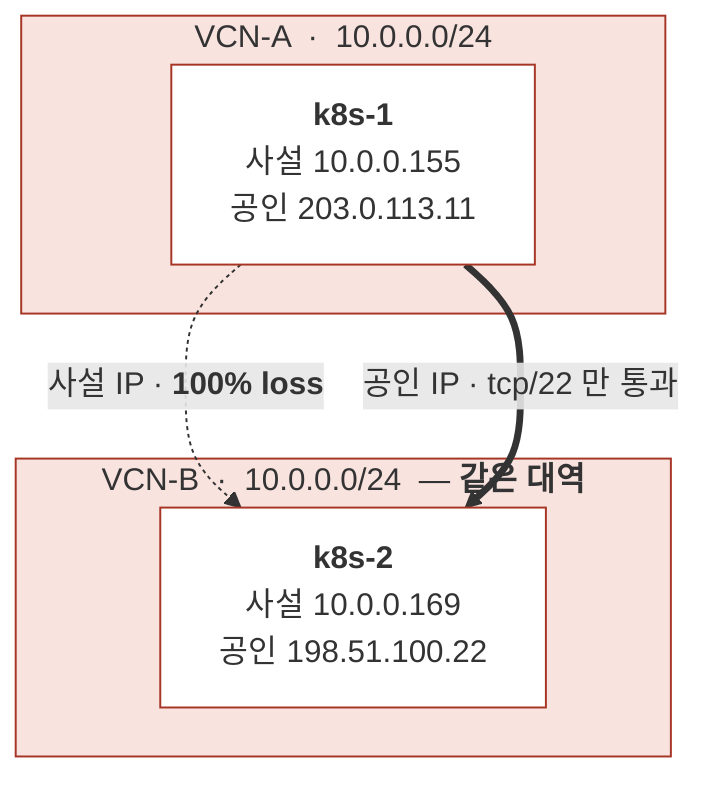

# Stage 0 — 기반 개념과 진단 도구

| | |
|---|---|
| 상태 | ✅ 완료 (2026-09-10) |
| 기록 | [`labs/stage-00-baseline.md`](../../labs/stage-00-baseline.md) |

## 확인한 상태

**두 호스트가 서로 다른 VCN에 있는데 사설 대역이 같다.**
사설 IP로는 영원히 닿지 않고, 공인 IP로도 `tcp/22` 하나만 열려 있다.

여기서 끝나지 않는다 — 포트를 다 열어도 클러스터는 성립하지 않는다.
쿠버네티스가 **"노드가 스스로 등록한 주소로 다른 노드가 접속한다"**를 전제하는데,
등록 가능한 주소(사설)는 닿지 않고 닿는 주소(공인)는 인터페이스에 없기 때문이다.

→ [`notes/network/concepts/02_node-addressing.md`](../../notes/network/concepts/02_node-addressing.md)

## 이 단계에서 한 일

클러스터를 만들기 전에 **"왜 그냥은 안 되는가"** 를 먼저 이해했다.
이 단계 없이 명령만 따라 쳤다면 Stage 8에서 반드시 막혔을 것이다.

- 사설 IP가 전역 고유하지 않다는 것, CIDR 중복 시 피어링이 불가능한 이유
  → [`notes/network/concepts/01_vcn-vpc.md`](../../notes/network/concepts/01_vcn-vpc.md)
- **노드 주소 문제** — 포트를 다 열어도 클러스터가 성립하지 않는 구조
  → [`notes/network/concepts/02_node-addressing.md`](../../notes/network/concepts/02_node-addressing.md)
- 진단 도구를 계층별로 (`ping` → `nc` → `tcpdump` → `ss`)
  → [`notes/network/diagnosis/`](../../notes/network/diagnosis/)
- etcd와 쿼럼 → [`notes/kubernetes/etcd.md`](../../notes/kubernetes/etcd.md)

## 완료 확인

두 노드 간 사설 통신 불가, 공인 tcp/22 양방향 가능을 실측했다.
환경 조사 결과는 [`docs/00-plan.md`](../00-plan.md).

## 이월 항목

UDP 51820 통과 검증은 **Stage 8로 미뤘다.** OCI 콘솔 작업이 선행돼야 하는데,
Stage 1~3은 k8s-2 내부에서만 이뤄져 노드 간 네트워크가 필요 없다.

다음: [Stage 1 — 가상화 기반](stage-01-virtualization.md)
