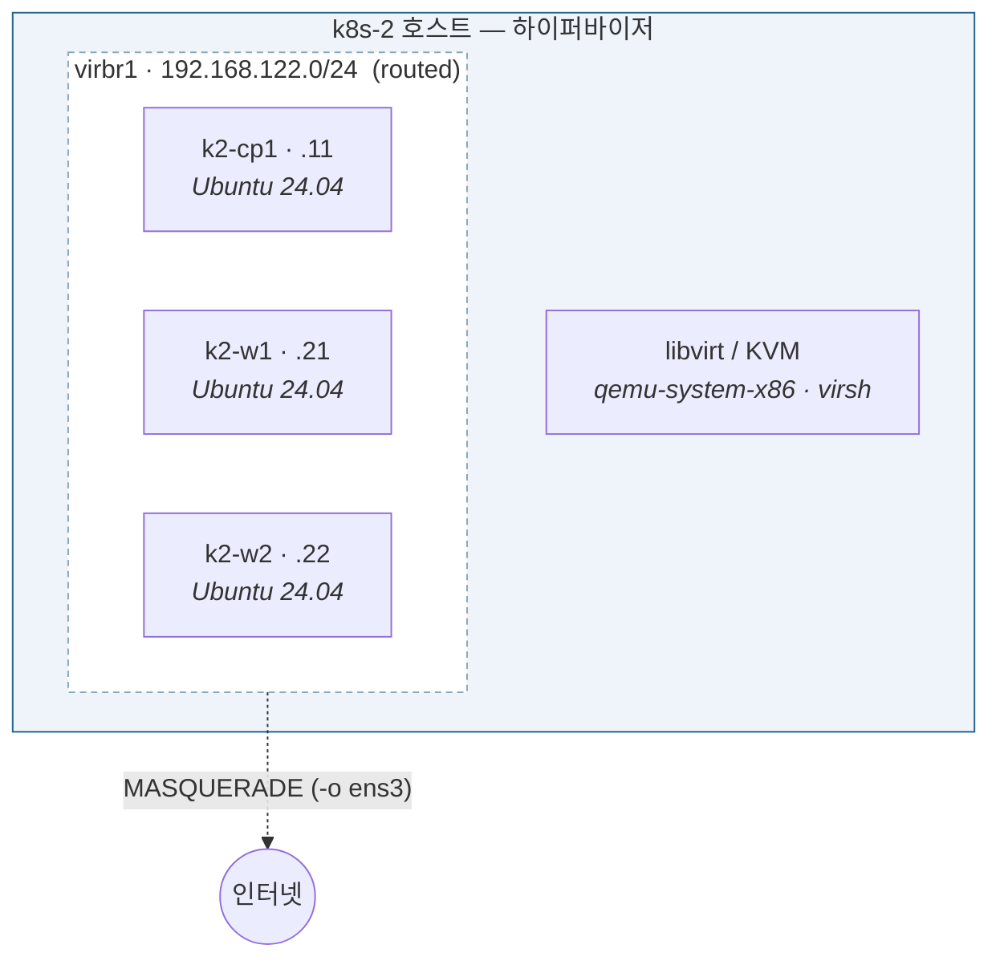

# Stage 1 — 가상화 기반

| | |
|---|---|
| 대상 | k8s-2 (32 vCPU / 251 GiB) |
| 예상 소요 | 반나절 |
| 선행 | Stage 0 |
| 기록할 곳 | [`labs/stage-01-virtualization.md`](../../labs/stage-01-virtualization.md) |

## 이 단계에서 하는 일

**VM을 자유롭게 만들고, 부수고, 되돌릴 수 있는 상태**를 만든다.
쿠버네티스는 아직 설치하지 않는다.

성과물은 **스냅샷으로 몇 초 만에 되돌아오는 실습 환경**이다.
Stage 10의 고장/복구 훈련(CKA 배점 30%)이 전부 여기 기대고 있다.
부수는 데 드는 비용이 0이 되어야 훈련을 반복하게 된다.

## 이 단계를 마치면



**VM 3대가 뜨고, 인터넷이 되고, 스냅샷으로 되돌릴 수 있는 상태.**
쿠버네티스는 아직 하나도 없다.

| 추가된 것 | 어디에 |
|---|---|
| libvirt · QEMU · virtinst | 호스트 |
| `k8snet` (routed, `virbr1`) | 호스트 |
| `ip_forward` + MASQUERADE (`-o ens3`만) | 호스트 |
| VM 3대 (OS만) | 호스트 위 |
| 스냅샷 `clean` / `fresh` | 각 VM |

## 완료 기준

- [ ] `virsh list --all`이 오류 없이 동작한다
- [ ] libvirt 네트워크가 **routed 모드**, 대역은 `192.168.122.0/24`
- [ ] VM이 부팅되고 SSH로 들어가진다
- [ ] VM에서 인터넷이 된다 (`apt update`가 성공)
- [ ] 스냅샷을 찍고 되돌렸을 때 변경이 사라진다
- [ ] 재부팅 후에도 네트워크와 NAT 규칙이 유지된다

> 개념 배경과 명령 레퍼런스는 [`notes/infra/libvirt-kvm.md`](../../notes/infra/libvirt-kvm.md).
> 이 문서는 **순서대로 실행하는 절차**다.

---

## 1. 패키지 설치

```bash
sudo apt-get update
sudo apt-get install -y \
  qemu-system-x86 qemu-utils \
  libvirt-daemon-system libvirt-clients \
  virtinst bridge-utils cloud-image-utils
```

각각이 무엇인지:

| 패키지 | 무엇 | 왜 필요한가 |
|---|---|---|
| `qemu-system-x86` | x86 VM을 실제로 실행하는 에뮬레이터 | **VM 하나 = QEMU 프로세스 하나.** 디스크·네트워크 카드 등 장치를 흉내 낸다 |
| `qemu-utils` | `qemu-img` 등 디스크 도구 | qcow2 이미지를 만들고, 크기를 바꾸고, 정보를 본다 |
| `libvirt-daemon-system` | `libvirtd` 데몬과 systemd 유닛 | VM·네트워크·스토리지를 **XML로 정의하고 관리**하는 계층. QEMU를 직접 다루지 않고 이걸 통한다 |
| `libvirt-clients` | `virsh` 등 클라이언트 | libvirtd에 명령을 보내는 CLI |
| `virtinst` | `virt-install`, `virt-clone` | VM을 **만들 때** 쓰는 헬퍼. 복잡한 XML을 대신 생성해준다 |
| `bridge-utils` | `brctl` | 가상 브리지 조회. 요즘은 `ip link`로도 되지만 진단할 때 편하다 |
| `cloud-image-utils` | `cloud-localds` | cloud-init 설정을 **ISO로 만들어** VM에 붙인다 |

> ⚠️ **`qemu-kvm` 패키지는 Ubuntu 26.04에 없다.** `qemu-system-x86`으로 이름이 바뀌었다.
> 인터넷의 옛 문서를 그대로 따라 하면 `Unable to locate package qemu-kvm`이 난다.

KVM 자체는 설치할 것이 없다. **커널 모듈이라 이미 들어 있다.**

```bash
lsmod | grep kvm
# kvm_intel  ...
# kvm        ...
```

---

## 2. 권한 부여

```bash
sudo usermod -aG libvirt,kvm $USER
```

두 그룹에 넣는데, 각각 무엇에 대한 권한인지:

| 그룹 | 접근 대상 | 없으면 |
|---|---|---|
| `libvirt` | `/var/run/libvirt/libvirt-sock` — libvirtd의 유닉스 소켓 | `virsh`가 데몬에 못 붙는다 |
| `kvm` | `/dev/kvm` — 하드웨어 가속 장치 | VM이 소프트웨어 에뮬레이션으로 돌아 **극단적으로 느려진다** |

`-a`는 append(기존 그룹 유지), `-G`는 보조 그룹 지정이다.
**`-a`를 빼면 기존 그룹이 전부 날아간다.** 주의할 것.

### ⚠️ 재로그인이 필요하다

그룹은 **로그인 시점에** 프로세스에 부여된다. 지금 열려 있는 셸에는 반영되지 않는다.

```bash
exit          # SSH 세션 종료
ssh k8s-2     # 다시 접속

id            # libvirt, kvm 이 보여야 한다
```

이걸 건너뛰면 다음 단계에서 이런 오류가 난다:

```
error: failed to connect to the hypervisor
error: Failed to connect socket to '/var/run/libvirt/libvirt-sock': Permission denied
```

---

## 3. 동작 확인

```bash
systemctl status libvirtd     # active (running) 이어야 함
virsh list --all              # 빈 목록이 나오면 정상
```

### `virsh`는 언제 쓰나

**VM을 만든 뒤의 모든 일상 조작**에 쓴다. `virt-install`은 만들 때 한 번뿐이고,
그 이후로는 계속 `virsh`다.

| 하는 일 | 명령 |
|---|---|
| 목록 보기 | `virsh list --all` |
| 시작 / 정상 종료 | `virsh start`, `virsh shutdown` |
| 강제 종료 (전원 뽑기) | `virsh destroy` |
| **삭제** | `virsh undefine` |
| IP 확인 | `virsh domifaddr` |
| 콘솔 접속 | `virsh console` |
| 네트워크 관리 | `virsh net-define`, `net-start`, `net-list` |
| 스냅샷 | `virsh snapshot-create-as`, `snapshot-revert` |
| 설정 편집 | `virsh edit`, `virsh dumpxml` |

> `destroy`는 **삭제가 아니라 강제 종료**다. 이름이 무서운데 전원 버튼 길게 누르기에 해당한다.
> 삭제는 `undefine`이다.

---

## 4. 네트워크 구성 — 이 단계의 핵심

### 4-1. 왜 이 대역인가

VM에 줄 대역은 **다른 네 개와 겹치면 안 된다.**

| 대역 | 값 | 용도 |
|---|---|---|
| 호스트 VCN | `10.0.0.0/24` | 클라우드가 준 것. 변경 불가 |
| WireGuard 터널 | `10.10.0.0/24` | Stage 8 |
| 파드 | `10.244.0.0/16` | Stage 2 |
| 서비스 | `10.96.0.0/12` | = 10.96.0.0 ~ 10.111.255.255 |
| **k8s-2의 VM** | **`192.168.122.0/24`** | libvirt 관례값 그대로 |
| **k8s-1의 VM** | **`192.168.121.0/24`** | Stage 8에서. 겹치면 안 되므로 121 |

`192.168.x`는 위 어느 것과도 겹치지 않는다.

### 4-2. 기본 네트워크 치우기

libvirt는 설치할 때 `default` 네트워크를 만든다 — **NAT 모드**에 `192.168.122.0/24`,
브리지는 `virbr0`. 우리가 쓸 대역과 정면으로 겹치므로 먼저 치운다.

```bash
virsh net-list --all
#  Name      State    Autostart   Persistent
#  default   active   yes         yes

sudo virsh net-destroy default              # 중지
sudo virsh net-autostart default --disable  # 자동 시작 해제
```

`net-destroy`도 삭제가 아니라 중지다. 정의는 남으니 나중에 되살릴 수 있다.

### 4-3. routed 네트워크 정의

**왜 NAT이 아니라 routed인가.**

NAT 모드는 VM이 밖으로 나갈 때 **출발지 주소를 호스트 IP로 바꿔버린다.**
Stage 8에서 k8s-1의 VM이 k8s-2의 VM에 접속하면:

```
k1-cp1 이 자기를 등록한 주소  : 192.168.121.11
k2-w1 가 실제로 보는 출발지   : 10.10.0.1        ← 불일치
```

[Stage 0에서 겪은 주소 불일치](../../notes/network/concepts/02_node-addressing.md)가 **한 층 안쪽에서 그대로 재발한다.**
routed 모드는 SNAT을 하지 않아 VM의 실제 주소가 보존된다.

> 나중에 바꾸려면 VM 네트워크를 전부 다시 잡아야 한다. **지금 routed로 만든다.**

파일을 하나 만든다:

```bash
cat > ~/k8snet.xml <<'XMLEOF'
<network>
  <name>k8snet</name>
  <forward mode='route'/>
  <bridge name='virbr1' stp='on' delay='0'/>
  <ip address='192.168.122.1' netmask='255.255.255.0'>
    <dhcp>
      <range start='192.168.122.200' end='192.168.122.250'/>
      <host mac='52:54:00:00:02:11' name='k2-cp1' ip='192.168.122.11'/>
      <host mac='52:54:00:00:02:21' name='k2-w1'  ip='192.168.122.21'/>
      <host mac='52:54:00:00:02:22' name='k2-w2'  ip='192.168.122.22'/>
    </dhcp>
  </ip>
</network>
XMLEOF
```

각 요소가 하는 일:

| 요소 | 뜻 |
|---|---|
| `<forward mode='route'/>` | **routed 모드.** NAT 없이 라우팅만 |
| `<bridge name='virbr1'/>` | 가상 스위치 이름. `default`의 `virbr0`와 겹치지 않게 |
| `<ip address='192.168.122.1'>` | 게이트웨이 주소 = 호스트가 이 네트워크에서 갖는 주소 |
| `<range>` | 임시 VM용 DHCP 풀 |
| `<host mac=... ip=...>` | **MAC별 고정 IP 예약** |

> 💡 **고정 IP를 DHCP 예약으로 주는 이유.**
> cloud-init에 static IP를 박아도 되지만, libvirt가 MAC↔IP를 관리하면
> **VM을 지우고 다시 만들어도 같은 주소가 나온다.**
> 쿠버네티스 노드 주소가 흔들리면 클러스터가 깨지므로 이 쪽이 안전하다.
>
> MAC의 `52:54:00`은 QEMU/KVM에 할당된 접두사다. 뒤 3바이트를 규칙적으로 준다
> (여기서는 `00:02:NN` — 02는 k8s-2, NN은 노드 번호).

정의하고 시작한다:

```bash
sudo virsh net-define ~/k8snet.xml
sudo virsh net-start k8snet
sudo virsh net-autostart k8snet

virsh net-list
#  Name     State    Autostart   Persistent
#  k8snet   active   yes         yes

ip addr show virbr1
#  inet 192.168.122.1/24 ...   ← 이렇게 나와야 정상
```

### 4-4. 인터넷 접속 — 호스트를 공유기로 만들기

쉽게 말하면 **집 공유기가 하는 일**을 호스트에 시키는 작업이다.

#### 문제 — 답장이 돌아올 주소가 없다

VM이 `apt update`를 하면 패킷에 **출발지 주소**가 찍힌다.

```
출발지: 192.168.122.11  (VM)
목적지: archive.ubuntu.com
```

인터넷까지는 나간다. 그런데 응답이 `192.168.122.11`로 돌아와야 하는데
**인터넷 어디에도 그 주소를 아는 곳이 없다.** VM 안에서만 의미 있는 주소이기 때문이다.
응답은 갈 곳을 잃고 버려진다.

> 편지 봉투의 반송 주소를 "3층 창고"라고 적은 것과 같다.
> 회사 안에서는 통하지만 우체국은 그게 어딘지 모른다.

#### 해결 — 나갈 때 주소를 바꿔치기

`MASQUERADE`가 하는 일이다.
**나갈 때 출발지를 호스트 주소로 바꾸고, 돌아온 응답을 원래 VM에게 되돌려준다.**

```
① k2-cp1(192.168.122.11) → archive.ubuntu.com

② 호스트가 ens3로 내보내며 출발지를 바꿈
   192.168.122.11  →  10.0.0.169   (호스트 주소)
   그리고 "이건 k2-cp1 거였다"를 표에 적어둔다

③ 응답이 10.0.0.169로 돌아옴

④ 호스트가 표를 보고 되돌림
   10.0.0.169  →  192.168.122.11
```

②의 표가 **conntrack**(연결 추적)이고 커널이 알아서 관리한다.

#### ⭐ `-o ens3`가 왜 중요한가

**나가는 문에 따라 처리가 달라야 하기 때문**이다. 호스트에는 나가는 문이 두 개 있다.

**문 ① `ens3` — 인터넷으로** → 주소를 **바꿔야** 한다

바깥은 `192.168.122.x`를 모르니, 바꿔주지 않으면 답장이 오지 않는다.

**문 ② `wg0` — 상대 호스트의 VM으로** (Stage 8) → 주소를 **바꾸면 안 된다**

터널 건너편은 `192.168.122.0/24`를 **안다.** `AllowedIPs`에 넣어두기 때문이다.
그리고 더 중요한 것은, 바꾸면 **쿠버네티스가 깨진다.**

| | k1-cp1이 보는 출발지 |
|---|---|
| NAT 안 함 | `192.168.122.11` ✅ k2-cp1이 등록한 주소와 일치 |
| NAT 함 | `10.10.0.2` ❌ 호스트 주소 |

[Stage 0의 주소 불일치](../../notes/network/concepts/02_node-addressing.md)가 그대로 재발한다.
그래서 **인터넷으로 나가는 문에만** 규칙을 건다.

#### `ip_forward` — 남의 패킷을 넘겨주도록 허용

리눅스는 기본적으로 **자기에게 온 패킷만 처리**한다.
남의 패킷을 받아 다른 인터페이스로 넘기지 않는다 — 그건 라우터가 하는 일이고,
일반 서버는 안 하는 편이 안전하기 때문이다.

그런데 VM의 패킷은 호스트 입장에서 **남의 패킷**이다.
`virbr1`로 들어와 `ens3`로 나가야 한다. 이를 허용하는 스위치가 `ip_forward`다.

```bash
echo 'net.ipv4.ip_forward=1' | sudo tee /etc/sysctl.d/99-router.conf   # 파일에 기록
sudo sysctl --system                                                    # 지금 적용
```

두 줄인 이유는 첫 줄이 **재부팅 후에도 유지되도록 기록**하는 것이고
둘째 줄이 **지금 반영**하는 것이기 때문이다.

#### NAT 규칙

```bash
sudo iptables -t nat -A POSTROUTING -s 192.168.122.0/24 -o ens3 -j MASQUERADE
```

| 조각 | 뜻 |
|---|---|
| `-t nat` | **NAT 테이블**에 규칙을 넣는다 (주소를 바꾸는 규칙들이 모인 곳) |
| `-A POSTROUTING` | **나가기 직전** 단계에 추가. 라우팅이 정해진 뒤라 출발지를 바꿔도 경로에 영향이 없다 |
| `-s 192.168.122.0/24` | **출발지가** VM 대역인 것만 |
| `-o ens3` | **`ens3`로 나가는** 것만 ← 핵심 |
| `-j MASQUERADE` | 출발지를 그 인터페이스의 현재 IP로 바꿔라 |

조건을 **모두 만족**해야 규칙이 적용된다.

> `MASQUERADE`는 인터페이스의 **현재 IP를 자동으로** 쓴다.
> `ens3`가 DHCP라 주소가 바뀔 수 있으므로 이쪽이 맞다.
> 고정 IP라면 `SNAT --to-source`를 쓰기도 한다.

#### 저장 — 안 하면 재부팅 때 사라진다

**iptables 규칙은 메모리에만 있다.**

```bash
sudo apt-get install -y iptables-persistent   # 설치 중 "저장할까요?" → Yes
sudo netfilter-persistent save                # 현재 규칙을 파일로
```

#### 확인

```bash
sudo iptables -t nat -L POSTROUTING -n -v | grep 192.168.122
```

방금 넣은 규칙이 보이면 성공이다. `-n`은 이름 해석 안 함(빠름), `-v`는 패킷 카운터 포함.
**VM에서 `apt update`를 돌린 뒤 카운터가 올라가면 규칙이 실제로 동작하는 것이다.**

```bash
sysctl net.ipv4.ip_forward
# net.ipv4.ip_forward = 1
```

> **한 줄로 정리하면:**
> 인터넷으로 나갈 때는 주소를 바꿔주고, 터널로 나갈 때는 그대로 둔다.
> 앞은 **답장을 받기 위해서**고, 뒤는 **쿠버네티스가 노드를 알아보기 위해서**다.

#### 여기까지가 이 단계의 네트워크 범위다

지금 연 것은 **VM을 지나가는 트래픽**(`FORWARD` 체인)이다.
**VM이 호스트 자신에게 말을 거는 것**(`INPUT` 체인)은 아직 닫혀 있다.

| 트래픽 | 체인 | 지금 |
|---|---|---|
| VM → 인터넷 (호스트를 **통과**) | `FORWARD` | ✅ 열림 |
| VM → **호스트 자신** (`192.168.122.1`) | **`INPUT`** | ❌ 닫힘 (SSH·DHCP·DNS 제외) |

**아직 필요하지 않으므로 열지 않는다.** VM이 호스트에게 요청할 것이 없기 때문이다.

Stage 2에서 호스트에 HAProxy를 올리면 상황이 바뀐다.
`--control-plane-endpoint`를 그 주소로 잡으면 **각 VM의 kubelet이
호스트의 HAProxy로 접속**하게 되므로, 그때 `6443`만 연다.

---

## 5. 베이스 이미지 받기

Ubuntu **cloud image**를 쓴다. 설치 과정 없이 바로 부팅되는 디스크 이미지라
ISO를 넣고 설치 마법사를 클릭할 필요가 없다.

```bash
sudo mkdir -p /var/lib/libvirt/images/base
cd /var/lib/libvirt/images/base
sudo curl -LO https://cloud-images.ubuntu.com/releases/24.04/release/ubuntu-24.04-server-cloudimg-amd64.img
ls -lh
```

> 💡 **VM의 OS는 호스트와 달라도 된다.**
> 호스트는 Ubuntu 26.04로 고정이지만 VM은 우리가 고른다.
> **24.04 LTS를 권한다** — kubeadm이 검증한 범위 안이라 Stage 2에서 변수가 하나 줄어든다.
> 26.04는 검증 대상 밖이라 preflight 경고가 날 수 있다.

---

## 6. VM 디스크 만들기

베이스 이미지를 **백킹 파일**로 두면 VM마다 전체를 복사하지 않는다.
빠르고 공간도 아낀다 — VM은 변경분만 자기 파일에 쓴다.

```bash
sudo qemu-img create -f qcow2 \
  -F qcow2 -b /var/lib/libvirt/images/base/ubuntu-24.04-server-cloudimg-amd64.img \
  /var/lib/libvirt/images/k2-cp1.qcow2 40G

sudo qemu-img info /var/lib/libvirt/images/k2-cp1.qcow2
```

| 옵션 | 뜻 |
|---|---|
| `-f qcow2` | 만들 파일의 형식 |
| `-b <경로>` | **백킹 파일** — 원본 이미지 |
| `-F qcow2` | 백킹 파일의 형식 (명시하지 않으면 경고) |
| `40G` | 논리 크기. 실제로는 쓴 만큼만 차지한다 |

---

## 7. cloud-init 설정 만들기

cloud image에는 **계정도 비밀번호도 없다.** 첫 부팅 때 cloud-init이 읽을 설정을
작은 ISO로 만들어 CD처럼 붙여준다.

### 7-1. 어느 기계의 키를 넣을 것인가

cloud-init은 키를 **만들지 않는다.** 우리가 준 공개키를 VM의
`~/.ssh/authorized_keys`에 써줄 뿐이다. 그래서 **VM에 접속할 주체**의 공개키를 넣어야 한다.

접속 경로가 둘이다.

```
① 맥 ──(ProxyJump k8s-2)──> VM        인증은 맥의 키로
② k8s-2 ─────────────────> VM        인증은 k8s-2의 키로
```

②가 필요한 이유는 **호스트에서 VM을 다루는 일이 많기 때문**이다.
10절의 스냅샷 검증이 그렇고, 앞으로 VM 6대를 스크립트로 다루게 되면 더 필요해진다.

> ⚠️ **맥의 개인키를 k8s-2로 복사하지 말 것.**
> 개인키는 기계 사이를 옮기지 않는다. 한 기계가 털리면 다른 기계까지 같이 털린다.
> **기계마다 키를 따로 만들고 공개키만 등록**하는 것이 원칙이다.

**두 공개키를 모두 등록하면 된다.** `ssh_authorized_keys`는 목록이다.

### 7-2. 공개키 준비

**k8s-2에서** — 아직 키가 없을 것이다. 갓 만든 서버이므로.

```bash
ls -la ~/.ssh/                          # id_* 파일이 있는지 확인

# 없으면 만든다 (있으면 건너뛴다)
ssh-keygen -t ed25519 -C "k8s-2 to VMs" -f ~/.ssh/id_ed25519 -N ""

cat ~/.ssh/id_ed25519.pub               # ← 이 줄 전체를 복사
```

`-N ""`는 암호구절 없이 만든다는 뜻이다. 스크립트로 VM을 다룰 것이라
매번 암호를 묻지 않게 한다. (호스트 접근이 이미 통제되어 있으므로 감수할 만하다.)

**맥에서** — 이미 쓰고 있는 키의 공개키를 확인한다.

```bash
cat ~/.ssh/id_ed25519_cryptolab.pub     # 또는 평소 쓰는 키
```

### 7-3. 파일 두 개를 만든다

**텍스트 파일 두 개를 만드는 것**이다. 이름이 정확히 `user-data`, `meta-data`여야 한다
(확장자 없음). cloud-init이 이 이름으로 찾도록 정해져 있다(NoCloud 방식).

```
~/vm/k2-cp1/
├── user-data     ← 만든다. 계정·SSH 키·호스트명
├── meta-data     ← 만든다. 인스턴스 식별자
└── seed.iso      ← cloud-localds 가 위 둘로 생성
```

```bash
mkdir -p ~/vm/k2-cp1 && cd ~/vm/k2-cp1
```

**`user-data`** — 공개키 두 줄은 7-2에서 확인한 실제 값으로 바꾼다.

```bash
cat > user-data <<'CLOUDCFG'
#cloud-config
hostname: k2-cp1
fqdn: k2-cp1
users:
  - name: ubuntu
    sudo: ALL=(ALL) NOPASSWD:ALL
    shell: /bin/bash
    ssh_authorized_keys:
      - ssh-ed25519 AAAA...맥의_공개키...
      - ssh-ed25519 AAAA...k8s-2의_공개키...
ssh_pwauth: false
package_update: true
CLOUDCFG
```

**`meta-data`**

```bash
cat > meta-data <<'METADATA'
instance-id: k2-cp1
local-hostname: k2-cp1
METADATA
```

> `cat > 파일명 <<'표시' ... 표시`는 여러 줄을 파일로 쓰는 방법이다.
> `vim user-data`로 직접 편집해도 똑같다.
>
> **공개키는 `ssh-ed25519 AAAA...`로 시작하는 한 줄 전체**를 그대로 붙여넣는다.
> 줄바꿈이 들어가면 인식되지 않는다.

각 항목의 뜻:

| 항목 | 뜻 |
|---|---|
| `#cloud-config` | **첫 줄에 반드시 있어야 한다.** 없으면 cloud-init이 통째로 무시한다 |
| `hostname` / `fqdn` | VM의 호스트명. 쿠버네티스 노드 이름이 된다 |
| `users` | 만들 계정. `sudo: NOPASSWD`로 자동화 가능하게 |
| `ssh_authorized_keys` | 등록할 **공개키 목록.** 여러 개 가능 |
| `ssh_pwauth: false` | 비밀번호 로그인 차단. 키만 허용 |
| `package_update` | 첫 부팅 때 `apt update` 실행 |
| `instance-id` | cloud-init이 "처음 부팅인가"를 판단하는 키. **VM마다 다르게** |

> ⚠️ **`instance-id`가 같으면 cloud-init이 건너뛴다.**
> "이미 처리한 인스턴스"로 보기 때문이다. VM을 새로 만들 때 이걸 안 바꾸면
> 계정이 생기지 않아 접속이 안 되는데, 원인 찾기가 은근히 어렵다.

### 7-4. ISO로 묶기

두 파일을 CD 이미지 하나로 만든다. VM에 이 CD를 꽂아주면 부팅 때 읽는다.

```bash
# 내용 확인 — 공개키가 제대로 들어갔는지
cat user-data

# ISO 생성
cloud-localds seed.iso user-data meta-data
ls -lh seed.iso                 # 몇 KB 짜리 파일이 생긴다

# libvirt 이미지 디렉터리로
sudo mv seed.iso /var/lib/libvirt/images/k2-cp1-seed.iso
```

`cloud-localds`는 `cloud-image-utils` 패키지에 들어 있다.
두 파일을 `cidata` 라벨이 붙은 ISO로 묶어주는데, cloud-init이 그 라벨을 보고 찾는다.

### 7-5. 맥에서 바로 들어가려면

VM 네트워크(`192.168.122.0/24`)는 k8s-2 안에만 존재하므로 맥에서 직접 안 닿는다.
`~/.ssh/config`에 `ProxyJump`를 걸면 한 번에 들어갈 수 있다.

```
Host k2-cp1
    HostName 192.168.122.11
    User ubuntu
    ProxyJump k8s-2
```

`ProxyJump`는 k8s-2를 **통로로만** 쓴다. VM 인증은 맥의 키로 이뤄지므로
7-3에 맥의 공개키를 넣어둔 것이다.

## 8. VM 생성

```bash
sudo virt-install \
  --name k2-cp1 \
  --memory 4096 --vcpus 2 \
  --disk path=/var/lib/libvirt/images/k2-cp1.qcow2,format=qcow2 \
  --disk path=/var/lib/libvirt/images/k2-cp1-seed.iso,device=cdrom \
  --network network=k8snet,mac=52:54:00:00:02:11 \
  --os-variant ubuntu24.04 \
  --graphics none \
  --import \
  --noautoconsole
```

| 옵션 | 뜻 |
|---|---|
| `--memory 4096` | MiB 단위. 4 GiB |
| `--vcpus 2` | kubeadm control plane 최소 요구가 2 |
| 첫 `--disk` | 방금 만든 시스템 디스크 |
| 둘째 `--disk ...device=cdrom` | cloud-init seed. CD로 붙인다 |
| `--network ...mac=` | **네트워크 XML의 DHCP 예약과 반드시 일치**시킬 것 |
| `--os-variant` | 최적 설정 힌트. 목록은 `osinfo-query os` |
| `--graphics none` | 그래픽 없음. 서버라 시리얼 콘솔만 쓴다 |
| `--import` | **설치 미디어 없이 기존 디스크로 바로 부팅** |
| `--noautoconsole` | 만들고 나서 콘솔에 자동으로 붙지 않음 |

`--import`가 cloud image를 쓰는 핵심이다. 이게 없으면 설치 ISO를 찾는다.

---

## 9. 접속 확인

```bash
virsh list --all
#  Id   Name     State
#  1    k2-cp1   running

virsh domifaddr k2-cp1
#  vnet0  52:54:00:00:02:11  ipv4  192.168.122.11/24   ← 예약한 주소가 나와야 함
```

부팅에 30초~1분쯤 걸린다. cloud-init이 계정을 만드는 시간이 필요하다.

> 너무 일찍 붙으면 이렇게 나온다:
> ```
> ssh: connect to host 192.168.122.11 port 22: Connection refused
> ```
> **장애가 아니다.** `refused`는 "주소에는 닿았지만 그 포트에 아무도 없다"는 뜻으로,
> `sshd`가 아직 안 뜬 것이다. 20~30초 뒤 다시 시도한다.
> (닿지 않으면 `refused`가 아니라 timeout이 난다.)

```bash
ssh ubuntu@192.168.122.11
```

안 되면 콘솔로 들어가 본다:

```bash
virsh console k2-cp1
# 빠져나올 때는 Ctrl + ]
```

VM 안에서:

```bash
cloud-init status --long     # done 이어야 정상
ip addr show
ping -c3 8.8.8.8             # 인터넷 확인
sudo apt-get update          # ← 완료 기준
```

`apt-get update`가 성공하면 4-4의 NAT 규칙이 제대로 걸린 것이다.

---

## 10. 스냅샷 검증 — 이 단계의 진짜 목적

**되돌리기가 되는지 반드시 확인하고 넘어간다.** 이게 안 되면 Stage 10이 성립하지 않는다.

```bash
# VM 안에서 표시를 하나 남긴다
ssh ubuntu@192.168.122.11 'touch ~/BEFORE_SNAPSHOT && ls ~'
```

```bash
# 호스트에서 스냅샷
virsh snapshot-create-as k2-cp1 --name clean --description "기본 상태"
virsh snapshot-list k2-cp1
```

```bash
# VM을 망가뜨린다
ssh ubuntu@192.168.122.11 'sudo rm -rf /etc/apt && touch ~/BROKEN && ls ~'
```

```bash
# 되돌린다
virsh snapshot-revert k2-cp1 clean
ssh ubuntu@192.168.122.11 'ls ~ && ls /etc/apt'
```

`BROKEN`이 사라지고 `BEFORE_SNAPSHOT`과 `/etc/apt`가 돌아와 있으면 성공이다.

| 명령 | 하는 일 |
|---|---|
| `snapshot-create-as <VM> --name <이름>` | 스냅샷 생성 |
| `snapshot-list <VM>` | 목록 |
| `snapshot-revert <VM> <이름>` | 되돌리기 |
| `snapshot-delete <VM> <이름>` | 삭제 |

VM이 **실행 중**이면 메모리 상태까지 저장해 느리고 용량이 크다.
**정지 상태**면 디스크만 저장해 빠르다.

> ✅ **백킹 파일 + 내부 스냅샷은 정상 동작한다** (2026-09-10 실측).
> 일부 환경에서 거부되는 경우가 있다고 알려져 있으나 이 구성에서는 문제없었다.
> 만약 실패하면 백킹 없이 전체 복사본으로 만들거나 `--disk-only`(외부 스냅샷)를 쓴다.

---

## 11. 재부팅 검증

패키지 설치 중 커널이 갱신되어 `*** System restart required ***`가 뜬다.
**VM을 더 만들기 전에 재부팅한다.** 그 김에 설정이 영구적인지 함께 검증된다.

```bash
sudo reboot
```

재접속 후:

```bash
virsh net-list                    # k8snet 이 active 인가 (autostart 확인)
sudo iptables -t nat -L POSTROUTING -n -v | grep 192.168.122   # 규칙이 남아있는가
sysctl net.ipv4.ip_forward        # = 1
virsh list --all                  # VM 상태
```

`k8snet`이 안 뜨거나 규칙이 사라졌다면 `net-autostart` 또는
`netfilter-persistent save`를 빠뜨린 것이다. **여기서 잡아야 Stage 8에서 안 헤맨다.**

> VM은 `virsh autostart <VM>`을 걸지 않으면 재부팅 후 자동으로 뜨지 않는다.
> 클러스터 노드는 자동 시작이 편하므로 Stage 2 이후 걸어두는 것을 권한다.

---

## VM을 추가로 만들 때 — 요약 체크리스트

Stage 3·8에서 이 절차를 여러 번 반복하게 된다.
**두 번째부터가 위험하다** — 문서 대신 기억에 의존하게 되기 때문이다.

**VM 하나 = 디스크 + seed + virt-install, 세 단계다.**

```bash
VM=k2-w1
MAC=52:54:00:00:02:21          # ← 반드시 확인
MEM=8192; CPU=4                # 워커는 8G/4, control plane 은 4G/2

# ① 디스크
sudo qemu-img create -f qcow2 \
  -F qcow2 -b /var/lib/libvirt/images/base/ubuntu-24.04-server-cloudimg-amd64.img \
  /var/lib/libvirt/images/$VM.qcow2 40G

# ② seed — user-data 의 hostname/fqdn, meta-data 의 instance-id 를 모두 $VM 으로
mkdir -p ~/vm/$VM && cd ~/vm/$VM
# (user-data, meta-data 작성)
cloud-localds seed.iso user-data meta-data
sudo mv seed.iso /var/lib/libvirt/images/$VM-seed.iso

# ③ 생성
sudo virt-install --name $VM --memory $MEM --vcpus $CPU \
  --disk path=/var/lib/libvirt/images/$VM.qcow2,format=qcow2 \
  --disk path=/var/lib/libvirt/images/$VM-seed.iso,device=cdrom \
  --network network=k8snet,mac=$MAC \
  --os-variant ubuntu24.04 --graphics none --import --noautoconsole
```

### 주소·MAC 대응표

| VM | MAC | IP | 역할 |
|---|---|---|---|
| `k2-cp1` | `52:54:00:00:02:11` | 192.168.122.11 | control plane |
| `k2-w1` | `52:54:00:00:02:21` | 192.168.122.21 | worker |
| `k2-w2` | `52:54:00:00:02:22` | 192.168.122.22 | worker |
| `k1-cp1` | `52:54:00:00:01:11` | 192.168.121.11 | control plane (Stage 8) |
| `k1-cp2` | `52:54:00:00:01:12` | 192.168.121.12 | control plane (Stage 8) |
| `k1-w1` | `52:54:00:00:01:21` | 192.168.121.21 | worker (Stage 8) |

### 만든 뒤 반드시 확인

```bash
virsh domifaddr $VM       # 예약한 IP 가 나오는가
ssh ubuntu@<IP> hostname  # 계획한 이름이 나오는가
```

> ⚠️ **libvirt의 MAC 중복 검사를 믿지 말 것.**
> 다른 VM이 쓰는 MAC은 거부하지만, **오타지만 아무도 안 쓰는 MAC은 통과한다.**
> 그러면 DHCP 예약에 없어 `.200~.250` 풀에서 임의 IP를 받고,
> VM은 정상으로 보이는데 **주소 계획이 조용히 깨진다.**
>
> ⚠️ **`instance-id`를 VM마다 다르게.** 같으면 cloud-init이
> "이미 처리한 인스턴스"로 보고 건너뛰어 계정이 생기지 않는다.

---

## 완료 후

- [`labs/stage-01-virtualization.md`](../../labs/stage-01-virtualization.md)에 실제로 친 명령과 출력을 기록
- 막힌 것은 **틀린 가설까지 포함해서** 남길 것
- 다음: [Stage 2 — 첫 클러스터](stage-02-first-cluster.md)

## 참고

- 개념과 명령 레퍼런스 → [`notes/infra/libvirt-kvm.md`](../../notes/infra/libvirt-kvm.md)
- 왜 주소가 중요한가 → [`notes/network/concepts/02_node-addressing.md`](../../notes/network/concepts/02_node-addressing.md)
- 자원 배분안 → [`notes/network/reference/nested-vm.md`](../../notes/network/reference/nested-vm.md)
