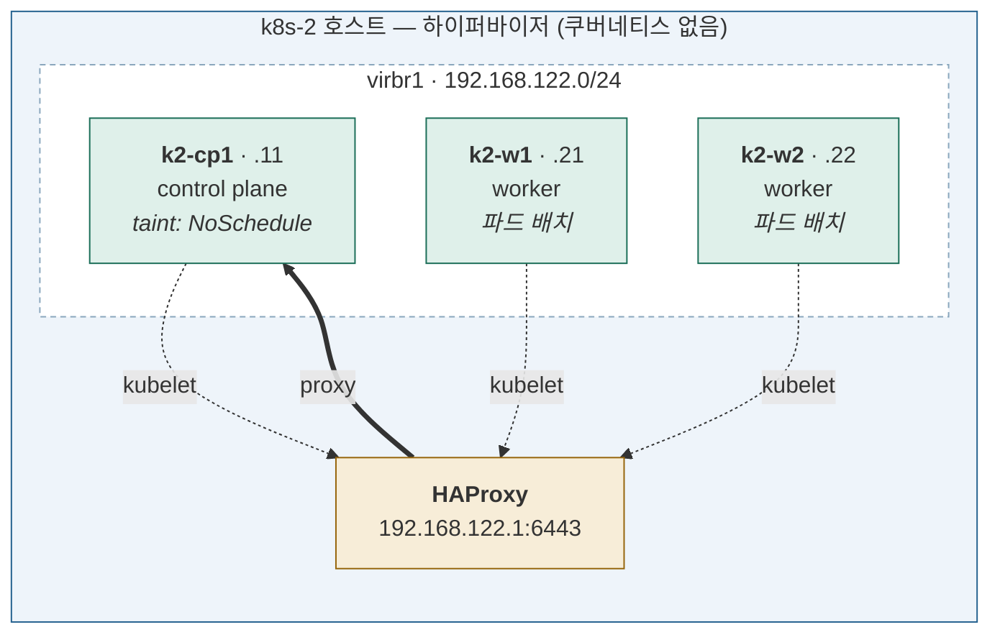

# Stage 3 — 다중 노드 (호스트 내부)

| | |
|---|---|
| 대상 | VM `k2-cp1` + `k2-w1` + `k2-w2` (전부 k8s-2 안) |
| 예상 소요 | 하루 |
| 선행 | [Stage 2](stage-02-first-cluster.md) |
| 기록할 곳 | `labs/stage-03-multi-node.md` |

## 이 단계에서 하는 일

**파드가 노드를 넘나드는 것을 눈으로 확인한다.**

아직 k8s-2 안이라 네트워크는 저절로 된다.
**스케줄러가 어떻게 배치를 결정하는지 관찰하는 것이 핵심**이고,
이것이 CKA Workloads & Scheduling(배점 15%)의 실습이 된다.

## 이 단계를 마치면



**3노드 클러스터.** 파드가 워커에 배치되고, 노드를 비우면 다른 노드로 옮겨간다.

세 노드의 kubelet이 **모두 HAProxy를 거쳐** apiserver에 접속한다.
호스트가 하나뿐이라 **장애 도메인도 하나**다 — Stage 8에서 k8s-1이 합류하며 둘이 된다.

| 추가된 것 | 어디에 |
|---|---|
| containerd · kubeadm · kubelet | k2-w1, k2-w2 |
| 클러스터 합류 (`kubeadm join`) | k2-w1, k2-w2 |
| `calico-node` (DaemonSet) 자동 배포 | 새 노드 |
| `worker` 역할 라벨 | k2-w1, k2-w2 |
| 스냅샷 `stage3-done` | VM 3대 |

## 완료 기준

- [ ] 3노드가 모두 `Ready`
- [ ] 파드가 워커에 배치된다 (Stage 2에서 `Pending`이던 것이 이제 뜬다)
- [ ] `requests`의 유무가 스케줄링에 미치는 영향을 확인했다
- [ ] `podAntiAffinity`로 배치를 강제해봤다
- [ ] `drain`했을 때 파드가 다른 노드에서 재생성된다
- [ ] kubelet을 죽여 `NotReady`를 만들고 복구했다

## 전제

- 워커 VM `k2-w1`(192.168.122.21), `k2-w2`(192.168.122.22)가 부팅되어 있다
- 세 VM 모두 `virsh list --all`에서 `running`

```bash
# 호스트에서
virsh list --all
```

---

## 1. 워커 노드 준비

워커에도 control plane과 **똑같은 준비**가 필요하다 —
커널 모듈, sysctl, containerd, kubeadm.

Stage 2에서 손으로 한 번 해봤으므로, 이번에는 스크립트로 묶는다.

> **왜 스크립트인가.** 두 번째부터는 학습이 아니라 노동이고 실수만 는다.
> 여러 줄을 터미널에 붙여넣다 명령이 유실되는 사고를 이미 겪었다.
> `curl`로 받아 실행하면 그 위험이 없다.
>
> **실행 전에 읽어볼 것.** 무엇을 하는지 모르고 돌리면
> Stage 2에서 익힌 의미가 사라진다.

각 워커에서:

```bash
ssh ubuntu@192.168.122.21          # 호스트에서

curl -sL https://raw.githubusercontent.com/JeekLee/k8s-study/main/scripts/prep-node.sh -o prep-node.sh
less prep-node.sh                  # 읽어본다
sudo bash prep-node.sh
```

`k2-w2`(192.168.122.22)에도 동일하게.

> 호스트에서 한 번에 돌리려면:
> ```bash
> for ip in 192.168.122.21 192.168.122.22; do
>   ssh ubuntu@$ip 'curl -sL https://raw.githubusercontent.com/JeekLee/k8s-study/main/scripts/prep-node.sh -o /tmp/p.sh && sudo bash /tmp/p.sh'
> done
> ```
> 다만 **처음 한 번은 스크립트를 읽고 수동으로 돌려볼 것.**

스크립트가 하는 일은 [`scripts/prep-node.sh`](../../scripts/prep-node.sh) 참고.
Stage 2의 2~4절과 같다. 다만 **워커에는 `kubectl`을 설치하지 않는다** —
관리 명령은 control plane이나 맥에서 친다.

### 확인

```bash
containerd --version
grep SystemdCgroup /etc/containerd/config.toml
kubeadm version -o short
systemctl is-active containerd
```

---

## 2. join — 호스트에서 던진다

### 왜 VM 터미널에 붙여넣지 않나

`kubeadm join` 명령은 토큰과 CA 해시가 붙어 **아주 길다.**
VM 터미널에 붙여넣으면 줄이 잘려 앞부분(`sudo kubeadm join`)이 통째로 유실되고,
남은 꼬리만 실행되어 이런 오류가 난다:

```
[ERROR IsPrivilegedUser]: user is not running as root
```

`sudo`를 빠뜨린 것처럼 보이지만 **실제로는 붙여넣기가 잘린 것**이다.

**호스트에서 SSH로 던지면 사람 손이 긴 문자열을 거치지 않는다.**

### 토큰 발급과 join

`kubeadm init`이 출력한 토큰은 **기본 24시간 뒤 만료**된다.
지났으면 재발급한다 — 어차피 CKA에 나오는 명령이다.

**k8s-2 호스트에서, 한 줄씩:**

```bash
JOIN=$(ssh ubuntu@192.168.122.11 'sudo kubeadm token create --print-join-command')
```

```bash
echo "$JOIN"
# kubeadm join 192.168.122.1:6443 --token ... --discovery-token-ca-cert-hash sha256:...
```

```bash
ssh ubuntu@192.168.122.21 "sudo $JOIN"
```

```bash
ssh ubuntu@192.168.122.22 "sudo $JOIN"
```

VM 들은 cloud-init 에서 NOPASSWD sudo 로 설정했으므로 tty 없이도 동작한다.

### 토큰 관련 명령

```bash
# control plane 에서
kubeadm token list                          # 남은 시간 확인
kubeadm token create --print-join-command    # 재발급 (가장 편하다)
kubeadm token delete <토큰>
```

`--print-join-command`는 토큰 생성과 CA 해시 계산을 한 번에 해준다.

> 해시를 직접 구하려면:
> ```bash
> openssl x509 -pubkey -in /etc/kubernetes/pki/ca.crt \
>   | openssl rsa -pubin -outform der 2>/dev/null \
>   | openssl dgst -sha256 -hex | sed 's/^.* //'
> ```
> **CA 해시는 왜 필요한가.** 워커가 엔드포인트에 접속했을 때
> **그것이 진짜 우리 클러스터인지** 확인하기 위해서다.
> 토큰은 "내가 들어갈 자격이 있다"를, 해시는 "네가 맞는 상대다"를 증명한다.
> 양방향 인증이다.

### join 출력에서 볼 것

```
[preflight] Running pre-flight checks
[preflight] Reading configuration from the "kubeadm-config" ConfigMap
[kubelet-start] Starting the kubelet
[kubelet-check] The kubelet is healthy after ...
This node has joined the cluster
```

**설정을 클러스터에서 받아온다.** `kubeadm-config` ConfigMap 과
`kubelet-config` 를 읽으므로, 워커에서 파드 CIDR 같은 값을 다시 줄 필요가 없다.

> 여기서 워커는 **엔드포인트(`192.168.122.1:6443`)로 접속**한다.
> Stage 2 의 [INPUT 방화벽 규칙](stage-02-first-cluster.md)이 없으면 이 단계에서 막힌다.

### 확인

```bash
# control plane 에서
kubectl get nodes
# NAME     STATUS   ROLES           AGE   VERSION
# k2-cp1   Ready    control-plane   1h    v1.35.8
# k2-w1    Ready    <none>          1m    v1.35.8
# k2-w2    Ready    <none>          1m    v1.35.8
```

`Ready`가 되기까지 30초~1분 걸린다. **Calico가 새 노드에 자동으로 배포**되기 때문이다.

```bash
kubectl get pods -n calico-system -o wide
# calico-node 가 노드마다 하나씩 (DaemonSet)
```

`ROLES`가 `<none>`인 것은 정상이다. 워커 역할 라벨은 kubeadm이 붙이지 않는다.
보기 좋게 하려면:

```bash
kubectl label node k2-w1 node-role.kubernetes.io/worker=
kubectl label node k2-w2 node-role.kubernetes.io/worker=
```

---

## 4. 스케줄러 관찰 — 이 단계의 핵심

> 스케줄러가 **필터 → 점수** 두 단계로 결정한다는 것과
> 플러그인별 가중치는 [`notes/kubernetes/scheduler.md`](../../notes/kubernetes/scheduler.md)에 정리했다.
> 아래 실험을 하면서 그 문서를 옆에 두면 관찰이 훨씬 선명해진다.


### 4-1. Stage 2에서 `Pending`이던 파드가 이제 뜬다

```bash
kubectl run no-tol --image=nginx
kubectl get pod no-tol -o wide
# NAME     READY   STATUS    NODE
# no-tol   1/1     Running   k2-w1        ← 워커에 배치됐다
```

control plane의 taint는 그대로인데 **이제 갈 곳이 생겼다.**
Stage 2에서 `untolerated taint`로 `Pending`이던 그 파드다.

```bash
kubectl delete pod no-tol
```

### 4-2. replica를 늘려 분산 관찰

```bash
kubectl create deployment web --image=nginx --replicas=6
kubectl get pods -o wide
```

`NODE` 열을 본다. 두 워커에 나뉘어 배치될 것이다.

> 쿠버네티스에는 **기본 topology spread 제약**이 있어서
> 같은 Deployment 의 파드를 노드에 어느 정도 흩뿌린다
> (`maxSkew: 3`, `whenUnsatisfiable: ScheduleAnyway`).
> 완벽히 균등하지는 않다 — **권고이지 강제가 아니기 때문**이다.

### 4-3. `requests` 와 `limits` — 무엇을 선언하는가

```bash
kubectl describe node k2-w1 | grep -A8 "Allocated resources"
```

```
Resource           Requests  Limits
--------           --------  ------
cpu                0 (0%)    0 (0%)
memory             0 (0%)    0 (0%)
ephemeral-storage  0 (0%)    0 (0%)
hugepages-1Gi      0 (0%)    0 (0%)
hugepages-2Mi      0 (0%)    0 (0%)
```

**파드 3개가 돌고 있는데 전부 0이다.** 고장이 아니다.

#### 둘 다 "측정값"이 아니라 "선언값"이다

| | 뜻 | 누가 보나 |
|---|---|---|
| **`requests`** | "이만큼은 **확보해줘**" | **스케줄러** — 어느 노드에 놓을지 정할 때 |
| **`limits`** | "이 이상은 **못 쓴다**" | **kubelet/커널** — cgroup 에 실제로 강제 |

`kubectl create deployment` 는 이 값을 적어주지 않는다. 편의 명령이라 최소 스펙만 만든다.
**안 적으면 0이고, 0은 "측정해보니 0"이 아니라 "선언하지 않았다"는 뜻이다.**

#### 실제로는 얼마나 쓰고 있나

노드에 들어가 cgroup 을 직접 본다. `kubectl top` 은 metrics-server 가 없어 아직 안 된다.

```bash
# 워커에서
for f in /sys/fs/cgroup/kubepods.slice/kubepods-besteffort.slice/kubepods-besteffort-pod*/memory.current; do
  echo "$(( $(cat $f) / 1024 / 1024 )) MiB"
done
```

실측(2026-09-11, `k2-w1`):

```
스케줄러 장부 :  memory 0 (0%)
실제 사용     :  339 MiB
memory.max    :  max          ← 상한 없음
```

**스케줄러는 이 노드가 텅 빈 줄 안다.** 파드를 계속 밀어넣다가
실제 메모리가 바닥나면 그때 OOM 이 터진다.
**`requests` 를 안 적는 것이 위험한 이유가 이것이다.**

#### CPU 와 메모리는 초과했을 때가 다르다

| | 초과 시 | 성격 |
|---|---|---|
| **CPU** | **스로틀링** — 느려질 뿐 죽지 않음 | 압축 가능 |
| **메모리** | **OOMKilled** — 즉시 강제 종료 | 압축 불가능 |

메모리는 "조금만 쓰게 하기"가 불가능하다. 이미 할당된 것을 뺏을 수 없으니 죽이는 수밖에 없다.

그래서 **`limits.memory` 는 걸고, `limits.cpu` 는 신중하게 쓴다.**
CPU 제한은 노드에 여유가 있는데도 인위적으로 느리게 만들 수 있다.

#### 자원 종류는 네 가지다

```bash
kubectl describe node k2-w1 | sed -n '/^Capacity:/,/^System Info:/p'
```

| 자원 | 이 노드의 Capacity | 초과 시 |
|---|---|---|
| `cpu` | 4 | 스로틀링 |
| `memory` | 7.7 GiB | **OOMKilled** (컨테이너 재시작) |
| `ephemeral-storage` | 37 GiB | **파드 축출** (Evicted) |
| `hugepages-1Gi` / `hugepages-2Mi` | **0** | — |

**`ephemeral-storage`** 는 노드 루트 디스크를 컨테이너가 쓰는 몫이다.
컨테이너 쓰기 레이어, `emptyDir`, 그리고 **컨테이너 로그**가 여기 쌓인다.
PV 와 달리 파드가 죽으면 함께 사라진다.

> 실무에서 흔한 사고 — 앱이 로그를 **파일로** 쌓다가 노드 디스크가 차고,
> kubelet 이 `DiskPressure` 를 선언해 **그 노드의 파드를 무더기로 축출**한다.
> 한 파드의 실수가 노드 전체를 망가뜨린다. 그래서 로그는 `stdout` 으로 내보낸다.

**`hugepages`** 만 이유가 다르다. **`Capacity` 부터 0**이다 —
선언을 안 해서가 아니라 **노드에 자원 자체가 없다.**

리눅스 기본 페이지는 4 KiB 인데, 수십 GB 를 쓰는 프로그램이면 페이지가 수백만 개가 되어
주소 변환 캐시(TLB)가 계속 미스를 낸다. hugepage 는 그 단위를 2 MiB 또는 1 GiB 로 키운다.
DPDK, 대형 DB, `-XX:+UseLargePages` 를 쓰는 JVM 등이 쓴다.

**노드에서 커널 파라미터로 미리 떼어놔야 하고, 떼어내는 순간 일반 메모리에서 빠진다.**
안 쓰면 낭비이므로 기본은 0이다. (`requests` 와 `limits` 가 같아야 한다 — 오버커밋 불가)

#### `Capacity` 와 `Allocatable` 이 다르다

```
Capacity:     memory: 8130776Ki
Allocatable:  memory: 8028376Ki      ← 약 100 MiB 적다
```

차이만큼이 **kubelet 과 시스템 몫으로 예약**된 것이다.
파드가 쓸 수 있는 것은 `Allocatable` 까지다.

#### 실습 — `requests` 를 준 파드와 비교

```bash
kubectl apply -f - <<'YAML'
apiVersion: apps/v1
kind: Deployment
metadata:
  name: sized
spec:
  replicas: 3
  selector:
    matchLabels: { app: sized }
  template:
    metadata:
      labels: { app: sized }
    spec:
      containers:
        - name: nginx
          image: nginx
          resources:
            requests:
              cpu: "1"
              memory: 1Gi
YAML

kubectl get pods -o wide -l app=sized
kubectl describe node k2-w1 | grep -A6 "Allocated resources"
```

볼 것:

1. **숫자가 올라간다** — `sized` 파드가 간 노드만
2. **`web` 6개는 여전히 0** — 같은 노드에서 실제로 돌고 있는데도
3. **3개가 2:1 로 나뉜다** — 첫 배치 뒤 그 노드의 여유가 줄어 다음은 반대쪽으로 간다.
   `requests` 가 있으니 이번에는 자원 점수가 실제로 작동한다

#### QoS 클래스 — 조합이 등급을 만든다

```bash
kubectl get pod -l app=web -o jsonpath='{.items[0].status.qosClass}'    # BestEffort
kubectl get pod -l app=sized -o jsonpath='{.items[0].status.qosClass}'  # Burstable
```

| 클래스 | 조건 | 메모리 부족 시 |
|---|---|---|
| `Guaranteed` | requests == limits (전부) | **가장 나중에** 축출 |
| `Burstable` | requests < limits | 중간 |
| **`BestEffort`** | **아무것도 없음** | **가장 먼저** 축출 |

실측에서 cgroup 경로가 `kubepods-besteffort.slice` 였던 것이 그 증거다.
**지금 `web` 파드들은 가장 먼저 쫓겨나는 등급**이다.

> 자세한 내용은 [`notes/kubernetes/resources.md`](../../notes/kubernetes/resources.md).
> QoS 를 실제로 다루는 것은 [Stage 7](stage-07-scheduling-ops.md) 이다.

### 4-4. 자원이 모자라면 `Pending`

워커는 4 vCPU 다. 감당 못 할 요청을 해본다.

```bash
kubectl run huge --image=nginx --overrides='
{"spec":{"containers":[{"name":"nginx","image":"nginx",
"resources":{"requests":{"cpu":"8"}}}]}}'

kubectl get pod huge
# NAME   READY   STATUS    AGE
# huge   0/1     Pending

kubectl describe pod huge | tail -5
# Warning  FailedScheduling  0/3 nodes are available:
#          1 node(s) had untolerated taint(s),
#          2 Insufficient cpu
```

**메시지가 노드별 탈락 이유를 알려준다.** control plane 은 taint 로,
워커 둘은 CPU 부족으로 탈락했다. 진단할 때 이 메시지를 읽는 습관이 중요하다.

```bash
kubectl delete pod huge
```

### 4-5. `podAntiAffinity` — 배치 강제

같은 앱의 파드를 **같은 노드에 두지 않도록** 강제한다.

```bash
kubectl apply -f - <<'YAML'
apiVersion: apps/v1
kind: Deployment
metadata:
  name: spread
spec:
  replicas: 3
  selector:
    matchLabels: { app: spread }
  template:
    metadata:
      labels: { app: spread }
    spec:
      affinity:
        podAntiAffinity:
          requiredDuringSchedulingIgnoredDuringExecution:
            - labelSelector:
                matchLabels: { app: spread }
              topologyKey: kubernetes.io/hostname
      containers:
        - name: nginx
          image: nginx
YAML

kubectl get pods -l app=spread -o wide
```

**워커가 2대인데 replica 가 3이므로 하나는 `Pending`이 된다.**

```bash
kubectl describe pod -l app=spread | grep -A3 Events | tail -5
# didn't match pod anti-affinity rules
```

| 옵션 | 뜻 |
|---|---|
| `requiredDuringScheduling...` | **강제.** 만족 못 하면 `Pending` |
| `preferredDuringScheduling...` | 권고. 만족 못 해도 배치는 된다 |
| `topologyKey` | 무엇을 "같은 곳"으로 볼지. `hostname`이면 노드 단위 |

`required`를 `preferred`로 바꿔 다시 해보면 세 번째도 배치된다. **직접 확인해볼 것.**

### 4-6. `topologySpreadConstraints`

anti-affinity 보다 세밀하게 "얼마나 치우쳐도 되는가"를 정한다.

```yaml
      topologySpreadConstraints:
        - maxSkew: 1
          topologyKey: kubernetes.io/hostname
          whenUnsatisfiable: DoNotSchedule
          labelSelector:
            matchLabels: { app: spread }
```

`maxSkew: 1`은 노드 간 파드 수 차이가 1을 넘지 않게 한다.
`DoNotSchedule`이면 강제, `ScheduleAnyway`면 권고다.

---

## 5. `cordon` · `drain` · `uncordon`

노드를 점검하거나 업그레이드할 때 쓴다. **CKA 단골이다.**

```bash
kubectl create deployment web --image=nginx --replicas=4    # 없으면 만들고
kubectl get pods -o wide
```

### cordon — 새 파드만 막는다

```bash
kubectl cordon k2-w1
kubectl get nodes
# k2-w1   Ready,SchedulingDisabled   <none>
```

**기존 파드는 그대로 있다.** 새로 배치되는 것만 피해간다.

### drain — 파드를 비운다

```bash
kubectl drain k2-w1 --ignore-daemonsets
```

| 옵션 | 왜 필요한가 |
|---|---|
| `--ignore-daemonsets` | `calico-node`, `kube-proxy` 는 DaemonSet 이라 옮길 수 없다. 없으면 오류 |
| `--delete-emptydir-data` | `emptyDir` 볼륨을 쓰는 파드가 있으면 필요 |
| `--force` | ReplicaSet 등에 속하지 않은 단독 파드가 있으면 필요 (지워진다) |

```bash
kubectl get pods -o wide          # k2-w1 의 파드가 k2-w2 로 옮겨갔다
kubectl get nodes                 # k2-w1 은 SchedulingDisabled 유지
```

> **`drain`은 `cordon`을 포함한다.** 비우기만 하고 다시 받으면 의미가 없으니까.

### uncordon — 되돌린다

```bash
kubectl uncordon k2-w1
kubectl get nodes                 # Ready 로 복귀
```

**이미 옮겨간 파드는 돌아오지 않는다.** 스케줄러는 되돌리지 않는다.
새로 만들어지는 파드부터 다시 배치된다.

---

## 6. 노드 장애 시뮬레이션

**Stage 10 고장 훈련의 예고편이다.** 스냅샷을 먼저 찍어두면 마음이 편하다.

```bash
# 워커에서
sudo systemctl stop kubelet
```

```bash
# control plane 에서 관찰
kubectl get nodes -w
```

| 경과 | 일어나는 일 |
|---|---|
| ~40초 | 노드가 `NotReady` (`node-monitor-grace-period`) |
| 그 즉시 | 노드에 `node.kubernetes.io/unreachable:NoExecute` taint |
| ~5분 뒤 | 파드가 축출된다 (기본 `tolerationSeconds: 300`) |

```bash
kubectl describe node k2-w1 | grep -A3 Taints
kubectl get pods -o wide -w
```

**파드는 바로 옮겨가지 않는다.** 일시적인 네트워크 문제일 수도 있으므로
5분을 기다린다. 이 지연이 `tolerationSeconds`고, 파드마다 조정할 수 있다.

복구:

```bash
# 워커에서
sudo systemctl start kubelet
```

```bash
kubectl get nodes                 # 다시 Ready
```

> **`NotReady`를 봤을 때 확인 순서**
> 1. 노드에서 `systemctl status kubelet`
> 2. `journalctl -u kubelet -e --no-pager | tail -30`
> 3. `systemctl status containerd`
> 4. 엔드포인트에 닿는가 — `nc -vz -w3 192.168.122.1 6443`

---

## 7. 검증과 스냅샷

```bash
kubectl get nodes -o wide         # 3노드 Ready, INTERNAL-IP 가 .11/.21/.22
kubectl get pods -A -o wide       # calico-node 가 노드마다 하나씩
kubectl top nodes                 # metrics-server 가 있다면
```

정리:

```bash
kubectl delete deployment web sized spread --ignore-not-found
```

스냅샷 — **세 VM 모두, 한 줄씩**:

```bash
# 호스트에서
for vm in k2-cp1 k2-w1 k2-w2; do virsh shutdown $vm; done

virsh list --all          # ← 셋 다 "shut off" 가 될 때까지 기다린다

for vm in k2-cp1 k2-w1 k2-w2; do
  virsh snapshot-create-as $vm --name stage3-done --description "3노드 클러스터"
done

for vm in k2-cp1 k2-w1 k2-w2; do virsh start $vm; done
```

> ⚠️ **`virsh shutdown`은 비동기다.** `shut off` 확인 없이 다음 줄로 가면
> 실행 중 스냅샷이 찍히고 `start`가 `already active`로 실패한다.
>
> ⚠️ **클러스터 스냅샷은 세 VM 을 함께 찍어야 의미가 있다.**
> 하나만 되돌리면 etcd 의 상태와 노드의 실제 상태가 어긋난다.

---

## 완료 후

- [`labs/`](../../labs/)에 기록
- 다음: [Stage 4 — 워크로드와 서비스](stage-04-workloads.md)
  클러스터는 만들었으니 이제 **무언가를 올린다.** 크로스 호스트(Stage 8)는
  돌아가는 앱이 생긴 뒤에 한다 — 그래야 터널이 앱을 깨뜨리는지 검증할 수 있다

## 자주 막히는 곳

| 증상 | 확인 |
|---|---|
| `kubeadm join`이 타임아웃 | 엔드포인트 도달 확인 — `nc -vz -w3 192.168.122.1 6443` |
| 토큰 만료 | `kubeadm token create --print-join-command` |
| `[ERROR IsPrivilegedUser]` | `sudo` 누락처럼 보이지만 **붙여넣기가 잘린 것**이 흔하다. 호스트에서 SSH 로 던질 것 |
| VM 에서 `clear`·`vim` 깨짐 | VM 에 terminfo 가 없다 — `infocmp -x $TERM \| ssh <VM> "sudo tic -x -o /usr/share/terminfo -"` |
| join 후 노드가 `NotReady` | `kubectl get pods -n calico-system -o wide` — 그 노드의 `calico-node` 상태 |
| `drain`이 거부됨 | `--ignore-daemonsets`, `--delete-emptydir-data` |
| 파드가 계속 `Pending` | `kubectl describe pod` 의 `FailedScheduling` 메시지를 끝까지 읽을 것 |
| 노드 이름이 IP 로 나옴 | cloud-init 의 `hostname` 설정 확인 |

관련: [`notes/kubernetes/scheduler.md`](../../notes/kubernetes/scheduler.md) · [`notes/kubernetes/cni.md`](../../notes/kubernetes/cni.md) ·
[`notes/network/diagnosis/`](../../notes/network/diagnosis/)
