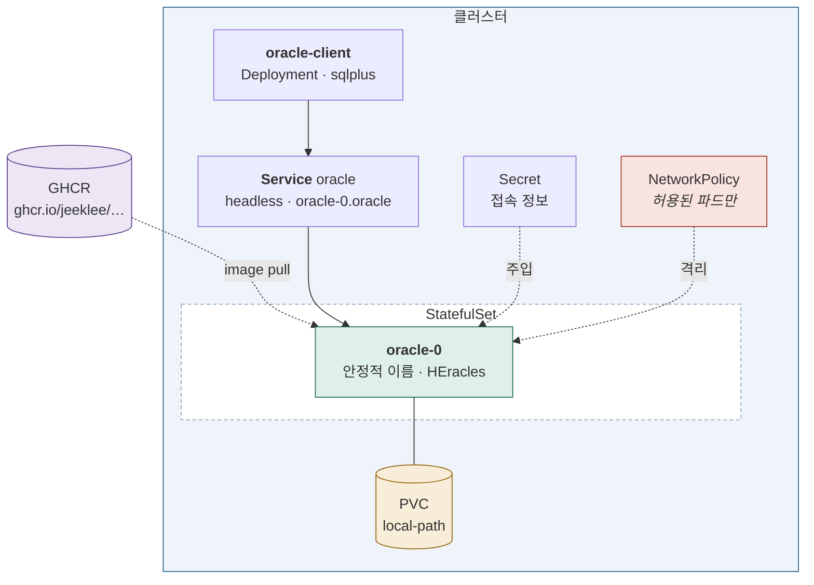

# Stage 4 — 데이터 계층 워크로드

| | |
|---|---|
| 대상 | 3노드 클러스터 (k8s-2 내부) |
| 예상 소요 | 2~3일 |
| 선행 | [Stage 3](stage-03-multi-node.md) |
| 워크로드 | **Oracle EE + [HEracles](https://cryptolab.gitbook.io/heracles)** |
| 기록할 곳 | `labs/stage-04-workloads.md` |

> Stage 3 까지는 `nginx` 를 아무렇게나 띄워 **스케줄러만** 봤다.
> 여기서부터는 **실제로 쓸 워크로드**를 제대로 올린다.

## 이 단계를 마치면



**상태를 가진 워크로드가 들어온다.** 파드가 죽어도 데이터가 남는다.

## 완료 기준

- [ ] 워커가 **12 vCPU / 96 GiB** 로 늘어났고 kubelet 이 그 값을 보고한다
- [ ] 워커에 **데이터 디스크 500 GB** 가 붙었다
- [ ] 내가 만든 이미지를 클러스터가 **GHCR 에서 받아온다**
- [ ] Oracle 파드를 지워도 **데이터가 남아 있다**
- [ ] `oracle-0.oracle` 이라는 **고정된 이름**으로 접속된다
- [ ] `HERACLES_MATCH` 쿼리가 결과를 돌려준다
- [ ] 접속 정보가 **Secret 으로 주입**된다 (매니페스트에 평문 없음)
- [ ] DB 파드가 **`Guaranteed` QoS** 다
- [ ] NetworkPolicy 로 **허용하지 않은 파드는 못 붙는다**

---

## 0. 노드 자원 확장 — Oracle EE 가 들어갈 자리를 만든다

**Stage 3 까지의 VM 스펙으로는 Oracle EE 가 뜨지 않는다.** 먼저 늘린다.

### 0-1. 현재 상태 (2026-09-14 측정)

```
호스트 k8s-2   32 vCPU / 251 GiB / 3.8 TB
할당됨         10 vCPU /  20 GiB          ← 31% / 8% 만 쓰고 있다
```

| VM | vCPU | 메모리 | 루트 디스크 |
|---|---|---|---|
| `k2-cp1` | 2 | 4 GiB | 38 GB |
| `k2-w1` | 4 | 8 GiB | 38 GB |
| `k2-w2` | 4 | 8 GiB | 38 GB |

문제가 둘이다.

- **메모리** — Oracle EE 한 인스턴스에 SGA + PGA 로 수십 GiB 가 필요한데 워커가 8 GiB 다
- **디스크** — 루트가 38 GB 다. **EE 이미지만 수 GB** 인데 여기에 PVC 까지 얹을 수 없다

### 0-2. 재배치

| VM | vCPU | 메모리 | 루트 | **데이터 디스크** |
|---|---|---|---|---|
| `k2-cp1` | **4** | **8 GiB** | 38 GB | — |
| `k2-w1` | **12** | **96 GiB** | 38 GB | **500 GB** |
| `k2-w2` | **12** | **96 GiB** | 38 GB | **500 GB** |
| 합계 | **28** | **200 GiB** | | 1 TB |
| 호스트 잔여 | 4 | 51 GiB | | 2.8 TB |

**왜 워커당 12 vCPU 인가** — [Stage 5](stage-05-db-scaling.md) 에서
Parallel Query 의 DOP 를 `1 → 2 → 4 → 8 → 12` 로 올리며 곡선을 그린다.
**점이 다섯 개는 있어야 꺾이는 지점이 보인다.**

**왜 96 GiB 인가** — Oracle 인스턴스 하나에 32 GiB (SGA 24 + PGA 6 + 여유) 를 잡으면
**두 개까지 올라간다.** Stage 5 의 샤드 4개(워커당 2개) 구성이 가능해진다.

> **데이터 디스크를 따로 붙이는 이유.** 루트를 키우는 것보다
> 기존 qcow2 체인을 건드리지 않아 안전하고, **Stage 5 에서 I/O 를 따로 관찰**하기 좋다.
> qcow2 는 희소(sparse) 파일이라 500 GB 로 만들어도 쓴 만큼만 차지한다.

> ⚠️ **라이선스는 VM 스펙으로 줄어들지 않는다.** Oracle 의 하드 파티셔닝 정책상
> 일반 KVM/libvirt 는 인정되지 않는 것이 보통이라, **호스트 32코어 전체**가
> 계산 대상이 될 수 있다. 사내 라이선스 담당자에게 확인해둘 것.

### 0-3. vCPU · 메모리 변경 — 종료하고 한다

**실행 중에는 바꿀 수 없다.** 순서대로 한 대씩.

```bash
# k8s-2 호스트에서
D=k2-w1                       # k2-w2, k2-cp1 도 같은 방식

sudo virsh shutdown $D
until [ "$(sudo virsh domstate $D)" = "shut off" ]; do sleep 2; done

sudo virsh setmaxmem  $D 98304M --config     # 96 GiB. maximum 을 먼저
sudo virsh setmem     $D 98304M --config
sudo virsh setvcpus   $D 12 --config --maximum
sudo virsh setvcpus   $D 12 --config

sudo virsh start $D
```

| VM | `setmaxmem` / `setmem` | `setvcpus` |
|---|---|---|
| `k2-cp1` | `8192M` | `4` |
| `k2-w1` | `98304M` | `12` |
| `k2-w2` | `98304M` | `12` |

> ⚠️ **`--maximum` 을 먼저 올려야 한다.** 현재값은 최대값을 넘을 수 없다.
> 순서를 바꾸면 `requested vcpus is greater than max allowable` 이 난다.

> ⚠️ **한 대씩 한다.** 세 대를 동시에 내리면 클러스터가 통째로 멈춘다.
> 워커 하나를 내릴 때는 먼저 비워두는 것이 정석이다 — Stage 3 에서 한 그대로다.
> ```bash
> kubectl drain k2-w1 --ignore-daemonsets --delete-emptydir-data
> # ... 재부팅 ...
> kubectl uncordon k2-w1
> ```

### 0-4. 데이터 디스크 추가 — 워커 두 대

```bash
# k8s-2 호스트에서
D=k2-w1
sudo qemu-img create -f qcow2 /var/lib/libvirt/images/$D-data.qcow2 500G

sudo virsh attach-disk $D   /var/lib/libvirt/images/$D-data.qcow2 vdb   --driver qemu --subdriver qcow2 --targetbus virtio --persistent
```

VM 안에서 포맷하고 마운트한다. **local-path-provisioner 가 쓰는 경로**에 붙인다.

```bash
# VM 안에서
lsblk                                   # vdb 가 보이는지
sudo mkfs.ext4 -L k8s-data /dev/vdb
sudo mkdir -p /opt/local-path-provisioner

# UUID 로 고정한다 — 장치 이름은 순서가 바뀔 수 있다
UUID=$(sudo blkid -s UUID -o value /dev/vdb)
echo "UUID=$UUID /opt/local-path-provisioner ext4 defaults 0 2" | sudo tee -a /etc/fstab
sudo mount -a
df -h /opt/local-path-provisioner       # 500G 가 보이면 성공
```

> ⚠️ **`/dev/vdb` 로 fstab 에 적지 않는다.** 디스크를 더 붙이면 이름이 밀릴 수 있고,
> 그러면 부팅이 실패한다. **UUID 를 쓴다.**

> **`--persistent` 를 빠뜨리면** 재부팅 후 디스크가 사라진다.
> 실행 중인 도메인과 설정 파일 양쪽에 반영하는 옵션이다.

### 0-5. 확인

```bash
# 호스트에서
for d in k2-cp1 k2-w1 k2-w2; do
  printf "%-8s vCPU=%s MEM=%sMiB
" "$d"     "$(sudo virsh dominfo $d | awk '/CPU\(s\)/{print $2}')"     "$(( $(sudo virsh dominfo $d | awk '/Max memory/{print $3}') / 1024 ))"
done
```

```bash
# 클러스터에서 — kubelet 이 늘어난 자원을 보고하는지
kubectl get nodes -o custom-columns=NAME:.metadata.name,CPU:.status.capacity.cpu,MEM:.status.capacity.memory
```

**여기 숫자가 안 바뀌면 kubelet 이 아직 옛 값을 들고 있는 것이다.** 재시작한다.

### 0-6. (선택) HugePages — Oracle 이 권장한다

큰 SGA 를 쓸 때 4 KiB 페이지로는 페이지 테이블 관리 비용이 커진다.
**Stage 5 에서 성능을 측정할 것이므로 영향이 있다.**

```bash
# VM 안에서 — 2 MiB × 13312 = 26 GiB
echo 'vm.nr_hugepages = 13312' | sudo tee /etc/sysctl.d/99-hugepages.conf
sudo sysctl --system
grep Huge /proc/meminfo
sudo systemctl restart kubelet          # 용량 재인식
```

```bash
kubectl describe node k2-w1 | grep -A6 Capacity      # hugepages-2Mi 가 0 이 아니게 된다
```

> Stage 3 에서 `hugepages-1Gi`, `hugepages-2Mi` 가 전부 0 이던 것을 봤다.
> **그때는 쓸 일이 없어서 0 이었고, 여기서 처음으로 값이 생긴다.**

> ⚠️ **HugePages 는 예약되는 즉시 일반 메모리에서 빠진다.** 96 GiB 중 26 GiB 가
> HugePages 전용이 되므로, 다른 파드가 쓸 수 있는 메모리는 70 GiB 다.
> Oracle 쪽에서도 `USE_LARGE_PAGES` 설정이 필요하다. **처음에는 건너뛰고,
> Stage 5 에서 성능이 기대에 못 미칠 때 돌아와도 된다.**

---

## 1. 이미지 — 어디서 오는가

### 1-1. 이미지 이름의 구조

```
ghcr.io/jeeklee/k8s-study-oracle-heracles:0.1.0
└─────┘ └─────┘ └──────────────────────┘ └───┘
레지스트리  네임스페이스        이미지 이름          태그
```

레지스트리를 생략하면 **Docker Hub 로 간다.** `nginx` 는 사실
`docker.io/library/nginx:latest` 다. 사설 레지스트리를 쓸 때 전체 경로를
반드시 적어야 하는 이유다.

> **`latest` 를 쓰지 않는다.** 같은 태그가 다른 내용을 가리키게 되면
> "어제는 됐는데 오늘은 안 된다"가 생기고 롤백할 지점도 사라진다.

### 1-2. ⭐ HEracles 를 어떻게 넣을 것인가 — 먼저 정한다

이 결정이 이 절의 무게를 정한다.

| 방식 | 장점 | 단점 |
|---|---|---|
| **커스텀 이미지에 포함** | **재현 가능**, 기동이 빠름, 버전이 태그에 박힌다 | 이미지를 직접 관리 |
| initContainer · 기동 스크립트 | 공식 이미지를 그대로 | **기동할 때마다 설치**, 느림, 네트워크 의존 |

**커스텀 이미지 쪽을 권한다.** [Stage 5](stage-05-db-scaling.md) 에서 인스턴스를 여러 개 띄울 때
기동 시간이 그대로 실험 시간이 되기 때문이다.

```dockerfile
# apps/oracle-heracles/Dockerfile — 형태 예시
FROM container-registry.oracle.com/database/enterprise:<버전>
USER root
COPY heracles/ /opt/heracles/
RUN /opt/heracles/install.sh
USER oracle
```

> ⚠️ **Oracle 공식 이미지는 로그인이 필요하다.**
> `container-registry.oracle.com` 에서 라이선스 동의 후 `docker login` 해야 받아진다.
> GitHub Actions 에서 빌드하려면 그 자격증명도 **Actions Secret** 으로 넣어야 한다.

> ⚠️ **HEracles 설치 파일을 저장소에 커밋하지 않는다.** 이 저장소는 공개다.
> 빌드 시점에 사내 경로에서 받아오거나, 이미지 빌드를 사내에서 하고
> 태그만 여기에 적는다.

### 1-3. 빌드하고 올리기

`apps/` 아래를 고치고 push 하면 **변경된 서비스만** 자동으로 다시 빌드된다
(`.github/workflows/build-images.yml`). 수동 실행은 Actions 탭 → `build-images`.

> **왜 로컬에서 빌드하지 않나.**
> 맥은 **arm64**, 클러스터 노드는 **amd64** 다.
> 로컬에서 그냥 빌드하면 파드가 `exec format error` 로 죽는다 — 원인 짐작이 어려운 증상이다.
> `--platform linux/amd64` 를 주면 되지만 에뮬레이션이라 느리다.
> **Oracle 이미지는 특히 크므로 더 그렇다.**

> ⚠️ **클러스터 노드에서 빌드하지 않는다.** 노드는 워크로드를 돌리는 곳이지 빌드 서버가 아니다.

### 1-4. `imagePullSecret`

이미지를 private 으로 두면 클러스터가 인증해야 한다.

```bash
# read:packages 권한만 있으면 된다 (pull 전용)
kubectl create secret docker-registry ghcr \
  --docker-server=ghcr.io \
  --docker-username=jeeklee \
  --docker-password=$GHCR_TOKEN
```

> **GHCR 패키지는 기본이 private 이다.** Actions 가 올린 것도 마찬가지라
> 이 Secret 없이는 `ImagePullBackOff` 가 난다.
> **private 인 채로 두고 연습하는 편이 낫다** — 실무가 그렇다.

```yaml
spec:
  imagePullSecrets:
    - name: ghcr
```

> **Secret 은 네임스페이스 단위다.** 다른 네임스페이스에 배포하면 거기에도 만들어야 한다.
> ServiceAccount 에 붙이면 그 SA 를 쓰는 모든 파드에 자동 적용된다.

---

## 2. 무엇으로 올릴 것인가

### 2-1. 왜 Pod 를 직접 만들지 않나

```bash
kubectl run tmp --image=nginx      # 이렇게 만든 Pod 는
kubectl delete pod tmp             # 지우면 끝이다
```

**Pod 는 되살아나지 않는다.** 노드가 죽으면 그대로 사라진다.
Stage 3 에서 `no-tol`, `huge` 를 그렇게 만들었는데, 그건 확인용이었다.

| 컨트롤러 | 언제 |
|---|---|
| **Deployment** | 상태 없는 앱. 대부분 이것 |
| **StatefulSet** | **안정적인 이름·저장소가 필요할 때 — DB** |
| **DaemonSet** | 노드마다 하나 (로그 수집, CNI) |
| **Job / CronJob** | 끝나는 작업 / 주기 실행 |

### 2-2. StatefulSet — Deployment 와 무엇이 다른가

| | Deployment | StatefulSet |
|---|---|---|
| 파드 이름 | `inventory-7d8f-x9k2` 무작위 | **`oracle-0`, `oracle-1`** 고정 |
| 생성 순서 | 동시 | **순차** (0 → 1 → 2) |
| 삭제 순서 | 동시 | **역순** (2 → 1 → 0) |
| 저장소 | 공유하거나 없음 | **파드마다 자기 PVC** |
| DNS | Service 이름만 | **파드마다** `oracle-0.oracle` |

DB 는 **"내가 몇 번인가"와 "내 데이터가 어디 있는가"** 가 중요하다. 그래서 StatefulSet 이다.

Stage 3 에서 본 것을 떠올려보면 차이가 분명하다. `web` 파드를
`rollout restart` 하니 이름과 IP 가 전부 갈렸다. **DB 가 그러면 곤란하다.**

### 2-3. StatefulSet 작성

`apps/manifests/oracle-sts.yaml`:

```yaml
apiVersion: apps/v1
kind: StatefulSet
metadata:
  name: oracle
spec:
  serviceName: oracle            # ← headless Service 이름. 6절에서 만든다
  replicas: 1
  selector:
    matchLabels: { app: oracle }
  template:
    metadata:
      labels: { app: oracle }
    spec:
      imagePullSecrets:
        - name: ghcr
      containers:
        - name: oracle
          image: ghcr.io/jeeklee/k8s-study-oracle-heracles:<태그>
          ports:
            - { containerPort: 1521, name: listener }
          env:
            - name: ORACLE_PWD
              valueFrom:
                secretKeyRef: { name: oracle-secret, key: password }
          resources:
            requests: { cpu: "8", memory: 32Gi }
            limits:   { cpu: "8", memory: 32Gi }     # ← Guaranteed. 7절 참고
          volumeMounts:
            - { name: data, mountPath: /opt/oracle/oradata }
          startupProbe:                               # ← 5절 참고
            tcpSocket: { port: 1521 }
            periodSeconds: 10
            failureThreshold: 60                      # 최대 10분 기다린다
          readinessProbe:
            tcpSocket: { port: 1521 }
            periodSeconds: 10
  volumeClaimTemplates:
    - metadata: { name: data }
      spec:
        accessModes: [ReadWriteOnce]
        resources: { requests: { storage: 100Gi } }
```

**`volumeClaimTemplates` 가 StatefulSet 의 핵심이다.** 파드마다 PVC 를 하나씩 만든다.
`oracle-0` 이 죽고 다시 떠도 **같은 PVC 를 다시 잡는다.**

### 2-4. 곁들이 — `oracle-client` Deployment

DB 에 붙어볼 클라이언트를 하나 둔다. **Deployment 를 써보는 김에 도구도 생긴다.**

```yaml
apiVersion: apps/v1
kind: Deployment
metadata:
  name: oracle-client
spec:
  replicas: 1
  selector:
    matchLabels: { app: oracle-client }
  template:
    metadata:
      labels: { app: oracle-client }      # ← NetworkPolicy 에서 이 라벨을 쓴다
    spec:
      containers:
        - name: client
          image: <sqlplus 또는 python-oracledb 이미지>
          command: ["sleep", "infinity"]
```

```bash
kubectl exec -it deploy/oracle-client -- sqlplus ...
```

---

## 3. 저장소 — PV · PVC · StorageClass

| 리소스 | 역할 |
|---|---|
| **PV** | 실제 저장 공간 |
| **PVC** | "이만큼 필요하다"는 요청 |
| **StorageClass** | PVC 가 오면 **PV 를 자동으로 만든다** (동적 프로비저닝) |

온프레미스라 `local-path-provisioner` 를 쓴다.
**노드의 로컬 디스크를 쓰므로 파드가 그 노드에 묶인다** — 이 제약을 직접 확인한다.

```bash
kubectl get sc                          # StorageClass 가 있는가
kubectl get pvc                         # data-oracle-0
kubectl get pv                          # 자동으로 만들어진 PV
kubectl get pvc data-oracle-0 -o jsonpath='{.spec.volumeName}'
```

| `accessModes` | 뜻 |
|---|---|
| `ReadWriteOnce` | **노드 하나**에서만 마운트 |
| `ReadWriteMany` | 여러 노드에서 동시에 (NFS 등 필요) |
| `ReadOnlyMany` | 여러 노드에서 읽기만 |

| `persistentVolumeReclaimPolicy` | PVC 삭제 시 |
|---|---|
| `Delete` | PV 와 데이터까지 삭제 |
| `Retain` | 남긴다 — **실수로 지우는 것을 막는다** |

### ⭐ 데이터가 남는지 직접 확인한다

```bash
# 테이블을 만들고 값을 넣은 뒤
kubectl delete pod oracle-0
kubectl get pods -w                     # 다시 뜬다
# 값이 그대로인지 확인
```

**이것이 이 단계의 완료 기준이다.** `emptyDir` 을 썼다면 여기서 사라진다.

> ⚠️ **StatefulSet 을 지워도 PVC 는 남는다.** 일부러 그렇게 설계됐다.
> 데이터를 정말 지우려면 PVC 도 따로 지워야 한다.
> ```bash
> kubectl delete sts oracle
> kubectl get pvc                       # data-oracle-0 이 그대로 있다
> ```

> ⚠️ **FHE 암호문은 원본보다 수십~수백 배 크다.** PVC 크기를 넉넉히 잡는다.
> 나중에 늘리려면 StorageClass 가 `allowVolumeExpansion` 을 지원해야 한다.

---

## 4. 설정 주입 — ConfigMap · Secret

```bash
kubectl create secret generic oracle-secret \
  --from-literal=password='<비밀번호>' \
  --from-literal=dsn='oracle-0.oracle:1521/FREEPDB1'

kubectl create configmap oracle-config \
  --from-literal=sga_target=12G
```

| 주입 방식 | 변경 시 반영 |
|---|---|
| `env` / `envFrom` | ❌ **파드를 다시 만들어야 한다** |
| 볼륨 마운트 | ✅ 수십 초 뒤 파일이 갱신됨 (앱이 다시 읽어야 함) |

**이 차이를 직접 확인할 것.** "설정을 바꿨는데 왜 안 바뀌지"의 원인이다.

> **Secret 은 etcd 에 base64 로만 저장된다. 암호화가 아니다.**
> `etcdctl` 로 직접 꺼내 확인해볼 것.
> → [`notes/kubernetes/etcd.md`](../../notes/kubernetes/etcd.md)

> ⚠️ **비밀번호·라이선스 키를 매니페스트에 적지 않는다.** 이 저장소는 공개다.
> 실제 값은 gitignore 된 `docs/hosts.local.md` 에만 둔다.

---

## 5. probe — Oracle 이 진짜로 필요로 하는 것

| probe | 실패하면 | 쓰임 |
|---|---|---|
| **liveness** | **컨테이너 재시작** | 데드락 등 살아는 있는데 망가진 상태 |
| **readiness** | **Service 에서 제외** (재시작 없음) | 기동 중이거나 일시적으로 바쁠 때 |
| **startup** | 재시작 | **기동이 느린 앱.** 성공할 때까지 다른 probe 를 막는다 |

### ⭐ `startupProbe` 가 없으면 Oracle 은 영원히 못 뜬다

Oracle 초기화는 **수 분**이 걸린다. `livenessProbe` 만 걸어두면:

```
0:00  컨테이너 시작, 초기화 중
0:30  liveness 실패 → 재시작
0:30  다시 초기화 시작
1:00  liveness 실패 → 재시작
      ... 영원히
```

**크래시루프의 전형적인 원인**이다. `startupProbe` 가 성공할 때까지
liveness·readiness 는 아예 검사되지 않는다.

```yaml
startupProbe:
  tcpSocket: { port: 1521 }
  periodSeconds: 10
  failureThreshold: 60      # 10초 × 60 = 최대 10분
```

> **liveness 를 공격적으로 잡으면 안 된다.** 부하가 몰려 응답이 느려졌을 뿐인데
> 재시작되고, 재시작하느라 더 느려지는 악순환이 생긴다.
> **readiness 로 빼는 것이 먼저**고 liveness 는 최후 수단이다.
> DB 는 특히 그렇다 — 재시작 비용이 크다.

---

## 6. Service — 파드 IP 를 믿을 수 없다

Stage 3 에서 `rollout restart` 했을 때 파드 IP 가 전부 갈렸다.
**IP 로 부를 수 없다**는 뜻이다.

```bash
kubectl get pods -o wide
kubectl delete pod oracle-0
kubectl get pods -o wide       # 새 IP
```

| 타입 | 접근 범위 |
|---|---|
| **ClusterIP** (기본) | 클러스터 내부만 |
| **headless** (`clusterIP: None`) | **가상 IP 없이 파드 주소를 직접 돌려준다** |
| **NodePort** | 모든 노드의 `30000~32767` 포트 |
| **LoadBalancer** | 클라우드 LB. 온프레미스에서는 MetalLB 등이 필요 |

### 6-1. headless Service — StatefulSet 의 짝

```yaml
apiVersion: v1
kind: Service
metadata:
  name: oracle
spec:
  clusterIP: None              # ← headless
  selector: { app: oracle }
  ports:
    - { port: 1521, name: listener }
```

**왜 headless 인가.** 일반 Service 는 가상 IP 하나를 주고 뒤에 있는 파드 중
아무거나 고른다. **DB 는 "0번에 붙고 싶다"가 필요하다.**

```
일반 Service   oracle           → 가상 IP → 아무 파드
headless       oracle           → 파드 주소 전부
               oracle-0.oracle  → 0번 파드 주소   ← 이게 필요하다
```

```bash
kubectl run -it --rm dbg --image=busybox:1.36 --restart=Never -- sh
# nslookup oracle
# nslookup oracle-0.oracle
```

### 6-2. DNS 이름 규칙

```
oracle                              같은 네임스페이스
oracle.default                      네임스페이스 지정
oracle.default.svc
oracle.default.svc.cluster.local    전체 이름 (FQDN)

oracle-0.oracle.default.svc.cluster.local    ← StatefulSet 파드
```

**CoreDNS 가 해석한다.** 파드의 `/etc/resolv.conf` 에
`search default.svc.cluster.local svc.cluster.local cluster.local` 이 들어 있어
짧은 이름도 찾아진다.

### 6-3. Service 가 보는 것은 파드가 아니라 Endpoints 다

```bash
kubectl get endpoints oracle
kubectl get endpointslice -l kubernetes.io/service-name=oracle
```

**readiness 를 통과한 파드만 Endpoints 에 들어간다.**
라벨로 고르는 것이 끝이 아니다.

기동 중인 Oracle 을 보면 바로 확인된다 — `Running` 인데 Endpoints 에는 없다.

> 일반 Service 의 로드밸런싱을 실제로 하는 것은
> **kube-proxy 가 각 노드에 써둔 iptables 규칙**이다.
> ```bash
> sudo iptables -t nat -L KUBE-SERVICES -n | grep oracle
> ```
> **이 분배가 긴 DB 커넥션에서 깨지는 것**을 [Stage 5](stage-05-db-scaling.md) 에서 다룬다.
> → [`notes/infra/nat-iptables.md`](../../notes/infra/nat-iptables.md)

---

## 7. 자원과 QoS — DB 를 보호한다

Stage 3 에서 `requests`·`limits` 와 QoS 를 봤다. 여기서는 **실제로 적용한다.**

```yaml
resources:
  requests: { cpu: "8", memory: 32Gi }
  limits:   { cpu: "8", memory: 32Gi }     # requests == limits
```

**12 vCPU / 96 GiB 워커에 하나가 들어가고 절반이 남는다.**
Stage 5 에서 샤드를 둘로 늘릴 때 같은 노드에 하나 더 올릴 수 있는 크기다.

```yaml
```

```bash
kubectl get pod oracle-0 -o jsonpath='{.status.qosClass}'    # Guaranteed
```

**`Guaranteed` 로 두는 이유** — 노드가 메모리 압박을 받으면 kubelet 이 파드를 축출하는데,
`BestEffort` → `Burstable` → `Guaranteed` 순으로 죽인다. **DB 가 먼저 죽으면 안 된다.**

> ⚠️ **SGA/PGA 합이 `limits.memory` 를 넘으면 OOMKill 된다.**
> Oracle 은 자기가 컨테이너 안이라는 것을 모르고 호스트 메모리를 보려 한다.
> `sga_target` 을 명시적으로 잡아준다.

> ⚠️ **`limits.cpu` 는 Parallel Query 를 제한한다.** DOP 를 16으로 줘도
> `limits.cpu: 4` 면 4코어 분량만 돈다. [Stage 5](stage-05-db-scaling.md) 의 측정 대상이다.

→ [`notes/kubernetes/resources.md`](../../notes/kubernetes/resources.md)

---

## 8. NetworkPolicy — 기본은 전부 허용

쿠버네티스는 **아무 파드나 아무 파드에 접속할 수 있다.**
정책을 만들어야 제한되고, 그것을 집행하는 것은 **CNI(Calico)** 다.

```yaml
apiVersion: networking.k8s.io/v1
kind: NetworkPolicy
metadata:
  name: oracle-only-client
spec:
  podSelector:
    matchLabels: { app: oracle }
  policyTypes: [Ingress]
  ingress:
    - from:
        - podSelector:
            matchLabels: { app: oracle-client }
      ports:
        - { port: 1521 }
```

**정책을 걸기 전후로 다른 파드에서 붙어보는 것**이 실습이다.

```bash
# 정책 전 — 붙는다
kubectl run -it --rm probe --image=busybox:1.36 --restart=Never -- \
  nc -zv oracle-0.oracle 1521

kubectl apply -f oracle-netpol.yaml

# 정책 후 — 막힌다 (라벨이 없으므로)
kubectl run -it --rm probe --image=busybox:1.36 --restart=Never -- \
  nc -zv oracle-0.oracle 1521
```

> 지원하지 않는 CNI 에서는 만들어도 **아무 일이 일어나지 않는다.** 오류도 안 난다.
> → [`notes/kubernetes/cni.md`](../../notes/kubernetes/cni.md)

---

## 9. 검증과 기록

```bash
kubectl get sts,pvc,svc,netpol
kubectl get pod oracle-0 -o jsonpath='{.status.qosClass}'
kubectl get endpoints oracle
```

HEracles 가 실제로 로드됐는지가 마지막 확인이다.

```sql
SELECT HERACLES_MATCH(enc_col, :q) FROM docs WHERE ROWNUM = 1;
```

```bash
# 스냅샷
for d in k2-cp1 k2-w1 k2-w2; do
  sudo virsh snapshot-create-as $d stage4-done --disk-only --atomic
done
```

기록: `labs/stage-04-workloads.md`
**`script -f ~/stage-04.log` 로 세션을 통째로 남겨둘 것** —
Stage 3 에서 출력을 못 남겨 기록이 반쪽이 됐다.

---

## 자주 막히는 곳

| 증상 | 확인 |
|---|---|
| `ImagePullBackOff` | `imagePullSecret` 이 있는가. 이미지 이름 전체 경로가 맞는가 |
| `exec format error` | 맥에서 빌드한 arm64 이미지. Actions 로 빌드할 것 |
| 파드가 계속 재시작 | **`startupProbe` 가 없다.** Oracle 초기화 시간을 못 기다린 것 |
| `OOMKilled` | SGA/PGA 합이 `limits.memory` 를 넘는다 |
| PVC 가 `Pending` | StorageClass 가 있는가. `kubectl get sc`. **데이터 디스크를 붙였는가** |
| 노드 용량이 안 늘어남 | kubelet 재시작. `virsh dominfo` 로 VM 쪽부터 확인 |
| `requested vcpus is greater than max` | `setvcpus --maximum` 을 먼저 해야 한다 |
| 재부팅하니 데이터 디스크가 없음 | `attach-disk` 에 `--persistent` 를 빠뜨렸다 |
| VM 이 부팅 실패 | fstab 에 `/dev/vdb` 를 적었다. UUID 로 바꾼다 |
| 파드가 특정 노드에만 뜸 | local-path 는 노드에 묶인다. 정상 |
| `Running` 인데 접속 거부 | 초기화 중. `kubectl get endpoints` 가 비어 있을 것 |
| `HERACLES_MATCH` 가 없다는 오류 | 확장이 로드되지 않았다. 설치 방식을 확인 |
| NetworkPolicy 가 안 먹음 | Calico 가 도는가. `policyTypes` 를 적었는가 |
| 데이터가 사라짐 | `emptyDir` 을 쓴 것은 아닌가. PVC 인지 확인 |

---

다음: [Stage 5 — DB 확장과 로드밸런싱](stage-05-db-scaling.md)
