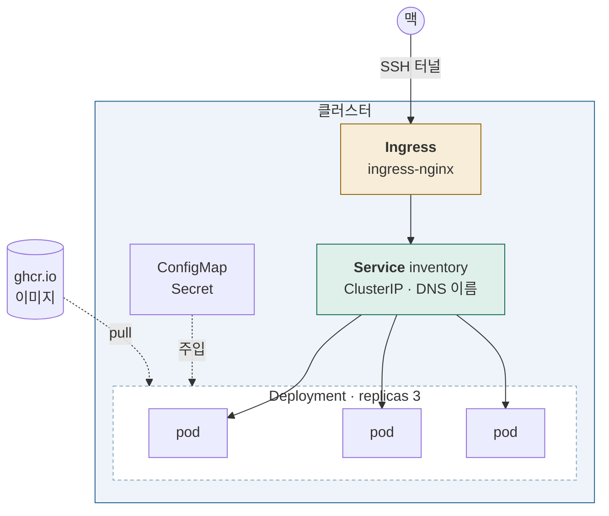

# Stage 4 — 워크로드와 서비스

| | |
|---|---|
| 대상 | 3노드 클러스터 (k8s-2 내부) |
| 예상 소요 | 1~2일 |
| 선행 | [Stage 3](stage-03-multi-node.md) |
| 앱 | [`apps/inventory`](../../apps/inventory/) (FastAPI) |
| 기록할 곳 | `labs/stage-04-workloads.md` |

## 이 단계를 마치면



**내가 만든 이미지가 클러스터에서 돌고, 이름으로 찾아지고, 밖에서 열린다.**

| 추가된 것 | 무엇 |
|---|---|
| GHCR 이미지 | `ghcr.io/<계정>/k8s-study-inventory` |
| `imagePullSecret` | private 레지스트리 인증 |
| Deployment (replicas 3) | 롤링 업데이트·롤백 |
| ConfigMap · Secret | 설정 주입 |
| liveness · readiness probe | 상태 확인 |
| Service (ClusterIP) | 안정적인 이름과 IP |
| Ingress Controller + Ingress | 외부 노출 |

## 완료 기준

- [ ] 직접 빌드한 이미지가 GHCR 에 올라가고 클러스터가 pull 한다
- [ ] 파드 3개가 워커에 분산 배치된다
- [ ] `curl` 을 반복하면 **응답하는 파드 이름이 바뀐다** (로드밸런싱)
- [ ] ConfigMap 값을 바꾸면 파드에 반영된다
- [ ] 이미지 태그를 올려 롤링 업데이트하고, 롤백한다
- [ ] readiness 를 실패시키면 **그 파드만 Service 에서 빠진다**
- [ ] 맥 브라우저에서 서비스가 열린다

---

## 1. 이미지 — 어디서 오는가

### 1-1. 이미지 이름의 구조

```
ghcr.io/jeeklee/k8s-study-inventory:a1b2c3d
└─────┘ └─────┘ └────────────────┘ └─────┘
레지스트리  네임스페이스    이미지 이름         태그
```

레지스트리를 생략하면 **Docker Hub 로 간다.** `nginx` 는 사실
`docker.io/library/nginx:latest` 다. 이것이 사설 레지스트리를 쓸 때
반드시 전체 경로를 적어야 하는 이유다.

| 지정 방식 | 예 | 성격 |
|---|---|---|
| 태그 | `:a1b2c3d` | **바뀔 수 있다.** 같은 태그에 다른 이미지를 올릴 수 있음 |
| digest | `@sha256:...` | **불변.** 그 내용 그대로 |

> ⚠️ **`latest` 를 쓰지 않는다.**
> 어떤 이미지가 돌고 있는지 알 수 없어지고, `imagePullPolicy` 기본값이
> `latest` 일 때만 `Always` 라 동작이 달라진다.
> **커밋 SHA 앞 7자리**를 태그로 쓴다.

| `imagePullPolicy` | 동작 | 기본값이 되는 때 |
|---|---|---|
| `Always` | 매번 레지스트리 확인 | 태그가 `latest` 이거나 생략 |
| `IfNotPresent` | 노드에 없을 때만 | 그 외 태그 |
| `Never` | 받지 않음 | — |

### 1-2. 빌드하고 올리기

**빌드는 맥이나 k8s-1 에서 한다.** 클러스터 노드에서 빌드하지 않는다 —
노드는 워크로드를 돌리는 곳이지 빌드 서버가 아니다.

```bash
cd apps/inventory

# GHCR 로그인 — GitHub Personal Access Token (write:packages 권한)
echo $GHCR_TOKEN | docker login ghcr.io -u <계정> --password-stdin

TAG=$(git rev-parse --short HEAD)
docker build -t ghcr.io/<계정>/k8s-study-inventory:$TAG .
docker push ghcr.io/<계정>/k8s-study-inventory:$TAG
```

> 맥이 Apple Silicon 이면 **아키텍처가 다르다.** 노드는 amd64 다.
> ```bash
> docker build --platform linux/amd64 -t ... .
> ```
> 이걸 빠뜨리면 파드가 `exec format error` 로 죽는다. 원인 짐작이 어려운 증상이다.

### 1-3. `imagePullSecret`

이미지를 private 으로 두면 클러스터가 인증해야 한다.

```bash
kubectl create secret docker-registry ghcr \
  --docker-server=ghcr.io \
  --docker-username=<계정> \
  --docker-password=$GHCR_TOKEN
```

파드에서 참조한다.

```yaml
spec:
  imagePullSecrets:
    - name: ghcr
```

> **Secret 은 네임스페이스 단위다.** 다른 네임스페이스에 배포하면 거기에도 만들어야 한다.
> ServiceAccount 에 붙이면 그 SA 를 쓰는 모든 파드에 자동 적용된다.

---

## 2. 파드를 올리는 방법

### 2-1. 왜 Pod 를 직접 만들지 않나

```bash
kubectl run tmp --image=nginx      # 이렇게 만든 Pod 는
kubectl delete pod tmp             # 지우면 끝이다
```

**Pod 는 되살아나지 않는다.** 노드가 죽으면 그대로 사라진다.

```
Deployment  ──관리──▶  ReplicaSet  ──관리──▶  Pod
   (버전)                 (개수)              (실행)
```

| 컨트롤러 | 언제 |
|---|---|
| **Deployment** | 상태 없는 앱. 대부분 이것 |
| **StatefulSet** | 안정적인 이름·저장소가 필요할 때 (DB) → Stage 5 |
| **DaemonSet** | 노드마다 하나 (로그 수집, CNI) |
| **Job / CronJob** | 끝나는 작업 / 주기 실행 |

### 2-2. Deployment 작성

`apps/manifests/inventory-deploy.yaml`:

```yaml
apiVersion: apps/v1
kind: Deployment
metadata:
  name: inventory
spec:
  replicas: 3
  selector:
    matchLabels: { app: inventory }
  template:
    metadata:
      labels: { app: inventory }
    spec:
      imagePullSecrets:
        - name: ghcr
      containers:
        - name: inventory
          image: ghcr.io/<계정>/k8s-study-inventory:<태그>
          ports:
            - containerPort: 8000
          env:
            - name: APP_VERSION
              value: "<태그>"
            - name: GREETING
              valueFrom:
                configMapKeyRef: { name: inventory-config, key: greeting }
          resources:
            requests: { cpu: 100m, memory: 128Mi }
            limits:   { memory: 256Mi }
          livenessProbe:
            httpGet: { path: /healthz, port: 8000 }
            periodSeconds: 10
          readinessProbe:
            httpGet: { path: /readyz, port: 8000 }
            periodSeconds: 5
```

> **`limits.cpu` 를 일부러 두지 않았다.** CPU 제한은 스로틀링을 일으키는데,
> 자원이 남는 환경에서는 득보다 실이 크다. 메모리는 넘으면 OOMKill 이므로 제한한다.
> → Stage 7 에서 QoS 클래스와 함께 다시 본다.

### 2-3. probe 세 가지

| probe | 실패하면 | 쓰임 |
|---|---|---|
| **liveness** | **컨테이너 재시작** | 데드락 등 살아는 있는데 망가진 상태 |
| **readiness** | **Service 에서 제외** (재시작 없음) | 기동 중이거나 일시적으로 바쁠 때 |
| **startup** | 재시작 | 기동이 느린 앱. 성공할 때까지 다른 probe 를 막는다 |

> **liveness 를 공격적으로 잡으면 안 된다.** 부하가 몰려 응답이 느려졌을 뿐인데
> 재시작되고, 재시작하느라 더 느려지는 악순환이 생긴다.
> **readiness 로 빼는 것이 먼저**고 liveness 는 최후 수단이다.

---

## 3. 설정 주입 — ConfigMap · Secret

```bash
kubectl create configmap inventory-config --from-literal=greeting="안녕하세요"
kubectl create secret generic inventory-secret --from-literal=api-key=s3cr3t
```

| 주입 방식 | 변경 시 반영 |
|---|---|
| `env` / `envFrom` | ❌ **파드를 다시 만들어야 한다** |
| 볼륨 마운트 | ✅ 수십 초 뒤 파일이 갱신됨 (앱이 다시 읽어야 함) |

```bash
kubectl edit configmap inventory-config       # 값 변경
kubectl get pods                              # 파드는 그대로
kubectl rollout restart deployment inventory  # 반영하려면 재시작
```

**이 차이를 직접 확인할 것.** "설정을 바꿨는데 왜 안 바뀌지"의 원인이다.

> Secret 은 etcd 에 **base64 로만** 저장된다. 암호화가 아니다.
> → [`notes/kubernetes/etcd.md`](../../notes/kubernetes/etcd.md)

---

## 4. Service — 파드 IP 를 믿을 수 없다

```bash
kubectl get pods -o wide       # 파드 IP 확인
kubectl delete pod <하나>
kubectl get pods -o wide       # 새 파드는 다른 IP
```

**파드 IP 는 재시작할 때마다 바뀐다.** 그래서 IP 로 부를 수 없다.

```bash
kubectl expose deployment inventory --port=80 --target-port=8000
kubectl get svc inventory
```

| 타입 | 접근 범위 |
|---|---|
| **ClusterIP** (기본) | 클러스터 내부만 |
| **NodePort** | 모든 노드의 `30000~32767` 포트 |
| **LoadBalancer** | 클라우드 LB. 온프레미스에서는 MetalLB 등이 필요 |
| **ExternalName** | 외부 DNS 이름으로 연결 (프록시 아님) |

### 4-1. DNS 이름 규칙

```
inventory                              같은 네임스페이스
inventory.default                      네임스페이스 지정
inventory.default.svc                  
inventory.default.svc.cluster.local    전체 이름 (FQDN)
```

```bash
kubectl run -it --rm dbg --image=busybox:1.36 --restart=Never -- sh
# nslookup inventory
# wget -qO- inventory
```

**CoreDNS 가 이 이름을 해석한다.** 파드의 `/etc/resolv.conf` 에
`search default.svc.cluster.local svc.cluster.local cluster.local` 이 들어 있어
짧은 이름도 찾아진다.

### 4-2. 로드밸런싱 확인

```bash
kubectl run -it --rm dbg --image=curlimages/curl:8.11.1 --restart=Never -- \
  sh -c 'for i in $(seq 10); do curl -s inventory | grep -o "\"pod\":\"[^\"]*\""; done'
```

**응답하는 파드 이름이 바뀌면 성공이다.**

> 이것을 실제로 하는 것은 **kube-proxy 가 각 노드에 써둔 iptables 규칙**이다.
> ```bash
> sudo iptables -t nat -L KUBE-SERVICES -n | grep inventory
> ```
> → [`notes/infra/nat-iptables.md`](../../notes/infra/nat-iptables.md)

### 4-3. readiness 로 빼보기

파드 하나에 들어가 `/readyz` 가 실패하게 만들면 **그 파드만 Endpoints 에서 빠진다.**

```bash
kubectl get endpoints inventory      # 주소 3개
# (파드 하나를 readiness 실패 상태로)
kubectl get endpoints inventory      # 주소 2개
```

**Service 가 무엇을 보고 라우팅하는지**가 드러난다 — 파드가 아니라 **Endpoints** 다.

---

## 5. 롤링 업데이트와 롤백

```bash
# 코드를 고치고 새 태그로 빌드·푸시한 뒤
kubectl set image deployment/inventory inventory=ghcr.io/<계정>/k8s-study-inventory:<새태그>

kubectl rollout status deployment/inventory
kubectl get pods -w                    # 하나씩 교체되는 것을 본다
```

```bash
kubectl rollout history deployment/inventory
kubectl rollout undo deployment/inventory              # 직전으로
kubectl rollout undo deployment/inventory --to-revision=2
```

**무중단으로 교체되는 이유**는 `readinessProbe` 때문이다.
새 파드가 준비될 때까지 Service 에 들어가지 않고, 그동안 옛 파드가 트래픽을 받는다.

```yaml
  strategy:
    rollingUpdate:
      maxUnavailable: 0      # 줄이지 않는다
      maxSurge: 1            # 하나씩 더 만들어 교체
```

> **`readinessProbe` 가 없으면 무중단이 아니다.** 컨테이너가 뜨자마자
> 준비된 것으로 보고 트래픽을 보내기 때문이다.

---

## 6. Ingress — 밖에서 열기

### 6-1. Ingress Controller 설치

**Ingress 리소스만 만들면 아무 일도 일어나지 않는다.**
그것을 읽고 실제로 처리하는 컨트롤러가 필요하다.

```bash
kubectl apply -f https://raw.githubusercontent.com/kubernetes/ingress-nginx/controller-v1.13.3/deploy/static/provider/baremetal/deploy.yaml
kubectl -n ingress-nginx get pods
kubectl -n ingress-nginx get svc
```

`baremetal` 판을 쓰는 이유는 **클라우드 LB 가 없기 때문**이다.
NodePort 로 노출된다.

### 6-2. Ingress 작성

```yaml
apiVersion: networking.k8s.io/v1
kind: Ingress
metadata:
  name: inventory
spec:
  ingressClassName: nginx
  rules:
    - host: inventory.local
      http:
        paths:
          - path: /
            pathType: Prefix
            backend:
              service:
                name: inventory
                port: { number: 80 }
```

### 6-3. 맥에서 열어보기

VM 네트워크는 k8s-2 안에만 있으므로 터널을 판다.

```bash
# NodePort 확인
kubectl -n ingress-nginx get svc ingress-nginx-controller

# 맥에서
ssh -L 8080:192.168.122.21:<NodePort> k8s-2
curl -H 'Host: inventory.local' localhost:8080
```

> **Ingress vs Gateway API**
> Ingress 는 오래됐고 기능 확장이 어노테이션에 몰려 벤더마다 다르다.
> **Gateway API** 가 후계로, 역할 분리(인프라팀 ↔ 앱팀)가 명확하다.
> CKA v1.35 범위에 Gateway API 가 포함되므로 Stage 10 에서 다시 본다.

---

## 7. 검증과 기록

```bash
kubectl get all
kubectl get pods -o wide          # 워커에 분산됐는가
kubectl get endpoints inventory
kubectl rollout history deployment/inventory
```

정리:

```bash
kubectl delete -f apps/manifests/      # 또는 개별 삭제
```

> Ingress Controller 는 남겨둔다. Stage 5·6 에서 계속 쓴다.

---

## 완료 후

- [`labs/`](../../labs/) 에 기록 — **이미지 태그와 GHCR 경로를 남길 것**
- 다음: [Stage 5 — 데이터 계층](stage-05-data-layer.md)

## 자주 막히는 곳

| 증상 | 확인 |
|---|---|
| `ImagePullBackOff` | `kubectl describe pod` — 인증 실패인지 경로 오타인지 |
| `exec format error` | 맥에서 빌드했다면 `--platform linux/amd64` |
| `ErrImagePull` + 401 | `imagePullSecret` 이 같은 네임스페이스에 있는가 |
| 파드는 `Running` 인데 접속 불가 | `kubectl get endpoints` — 비어 있으면 readiness 실패 |
| ConfigMap 을 바꿨는데 그대로 | `env` 주입은 재시작 필요 — `rollout restart` |
| Ingress 가 404 | `ingressClassName`, `Host` 헤더, 컨트롤러 파드 상태 |
| DNS 가 안 됨 | `kubectl -n kube-system get pods -l k8s-app=kube-dns` |

관련: [`apps/README.md`](../../apps/README.md) ·
[`notes/kubernetes/scheduler.md`](../../notes/kubernetes/scheduler.md) ·
[`notes/infra/nat-iptables.md`](../../notes/infra/nat-iptables.md)
