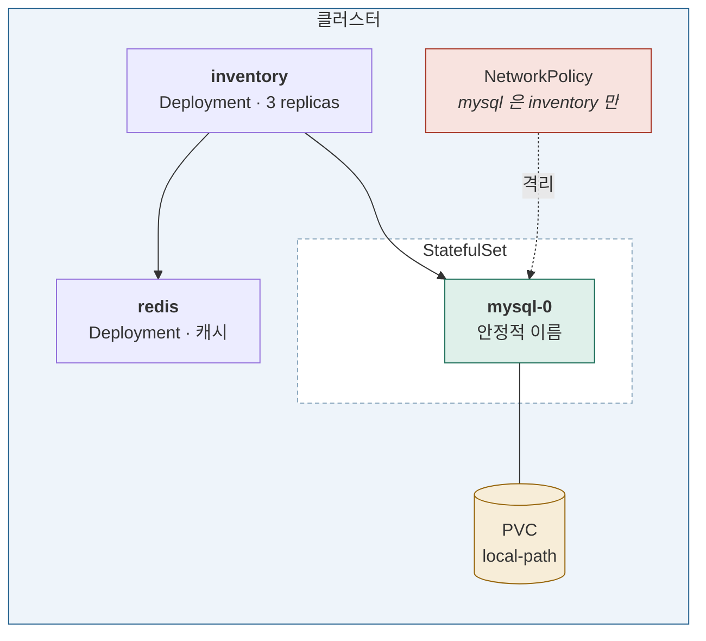

# Stage 5 — 데이터 계층

| | |
|---|---|
| 예상 소요 | 2~3일 |
| 선행 | [Stage 4](stage-04-workloads.md) |
| 앱 | `inventory` + MySQL + Redis, **Oracle EE + HEracles** |
| 기록할 곳 | `labs/stage-05-data-layer.md` |

> 📝 계획 수준. 진입할 때 실행 절차로 확장한다.

## 이 단계를 마치면



**상태를 가진 워크로드가 들어온다.** 파드가 죽어도 데이터가 남는다.

## 완료 기준

- [ ] MySQL 파드를 지워도 **데이터가 남아 있다**
- [ ] `inventory` 가 DNS 이름으로 DB 에 붙는다
- [ ] 마이그레이션이 initContainer 로 먼저 실행된다
- [ ] NetworkPolicy 로 **DB 에 다른 파드는 못 붙는다**
- [ ] Redis 캐시가 동작한다
- [ ] **Oracle EE 가 StatefulSet 으로 뜨고 HEracles 확장이 로드된다**
- [ ] `HERACLES_MATCH` 쿼리가 결과를 돌려준다 (성능은 [Stage 6](stage-06-db-scaling.md) 에서)

## 다룰 것

### StatefulSet — Deployment 와 무엇이 다른가

| | Deployment | StatefulSet |
|---|---|---|
| 파드 이름 | `inventory-7d8f-x9k2` 무작위 | **`mysql-0`, `mysql-1`** 고정 |
| 생성 순서 | 동시 | **순차** (0 → 1 → 2) |
| 저장소 | 공유하거나 없음 | **파드마다 자기 PVC** |
| DNS | Service 이름만 | **파드마다** `mysql-0.mysql` |

DB 는 "내가 몇 번인가"와 "내 데이터가 어디 있는가"가 중요하다. 그래서 StatefulSet 이다.

### 저장소

| 리소스 | 역할 |
|---|---|
| **PV** | 실제 저장 공간 |
| **PVC** | "이만큼 필요하다"는 요청 |
| **StorageClass** | PVC 가 오면 **PV 를 자동으로 만든다** (동적 프로비저닝) |

온프레미스라 `local-path-provisioner` 를 쓴다.
**노드의 로컬 디스크를 쓰므로 파드가 그 노드에 묶인다** — 이 제약을 직접 확인한다.

| `accessModes` | 뜻 |
|---|---|
| `ReadWriteOnce` | **노드 하나**에서만 마운트 |
| `ReadWriteMany` | 여러 노드에서 동시에 (NFS 등 필요) |
| `ReadOnlyMany` | 여러 노드에서 읽기만 |

| `persistentVolumeReclaimPolicy` | PVC 삭제 시 |
|---|---|
| `Delete` | PV 와 데이터까지 삭제 |
| `Retain` | 남긴다 — **실수로 지우는 것을 막는다** |

### initContainer — 순서를 강제한다

앱이 뜨기 전에 스키마가 준비돼야 한다.

```yaml
      initContainers:
        - name: migrate
          image: <마이그레이션 이미지>
      containers:
        - name: inventory
```

**initContainer 가 끝나야 본 컨테이너가 시작된다.** 실패하면 재시도하며 대기한다.
DB 가 아직 안 떴을 때 앱이 크래시루프에 빠지는 것을 막는 용도로도 쓴다.

### NetworkPolicy — 기본은 전부 허용

쿠버네티스는 **아무 파드나 아무 파드에 접속할 수 있다.**
정책을 만들어야 제한되고, 그것을 집행하는 것은 **CNI(Calico)** 다.

```yaml
# mysql 은 inventory 라벨을 가진 파드에서만
  podSelector:
    matchLabels: { app: mysql }
  ingress:
    - from:
        - podSelector:
            matchLabels: { app: inventory }
```

**정책을 걸기 전후로 다른 파드에서 붙어보는 것**이 실습이다.

> 지원하지 않는 CNI 에서는 만들어도 아무 일이 일어나지 않는다.
> → [`notes/kubernetes/cni.md`](../../notes/kubernetes/cni.md)

### Oracle EE + HEracles — 여기서는 띄우기만 한다

[Stage 6](stage-06-db-scaling.md) 에서 확장 실험의 대상이 되는 DB 다.
**이 단계의 목표는 "한 인스턴스가 정상 동작한다"까지**이고, 성능 측정은 하지 않는다.

[HEracles](https://cryptolab.gitbook.io/heracles) 는 동형암호(FHE)로 **암호문을 복호화하지 않고 검색**하는
DBMS 확장이다. 별도 서버 없이 기존 DBMS 에 확장으로 설치된다.

```sql
SELECT id FROM docs WHERE HERACLES_MATCH(enc_col, :q) = 1;
```

MySQL 과 달리 신경 쓸 것이 몇 가지 더 있다.

| 항목 | 내용 |
|---|---|
| **라이선스** | EE 는 컨테이너에서도 **호스트 전체 코어 기준**으로 계산되는 것이 일반적. k8s-1(16) + k8s-2(32) = 48코어가 대상이 될 수 있다 |
| **메모리** | SGA/PGA 를 `limits.memory` 안에 맞춰야 한다. 넘으면 OOMKill |
| **QoS** | `requests == limits` 로 **`Guaranteed`** — 노드가 압박받을 때 DB 가 먼저 죽으면 안 된다 |
| **저장 용량** | **FHE 암호문은 원본보다 수십~수백 배 크다.** PVC 크기를 넉넉히 |
| **기동 시간** | 초기화에 수 분이 걸린다. `startupProbe` 를 길게 잡는다 |

**HEracles 설치 방식을 먼저 정한다.**

| 방식 | 장점 | 단점 |
|---|---|---|
| 커스텀 이미지에 포함 | **재현 가능**, 기동이 빠름, GHCR 에 올려둔다 | 이미지를 직접 관리 |
| initContainer·기동 스크립트 | 공식 이미지를 그대로 | 기동할 때마다 설치, 느림 |

> Stage 4 에서 GitHub Actions → GHCR 파이프라인을 이미 만들었다.
> **커스텀 이미지 쪽이 이 저장소의 흐름과 맞는다.**

```yaml
# 확장이 실제로 로드됐는지 — 이것이 이 절의 완료 확인이다
kubectl exec -it oracle-0 -- sqlplus ...
SQL> SELECT HERACLES_MATCH(enc_col, :q) FROM docs WHERE ROWNUM = 1;
```

> ⚠️ **접속 정보·라이선스 키는 저장소에 올리지 않는다.** `Secret` 으로 주입하고
> 실제 값은 gitignore 된 `docs/hosts.local.md` 에만 둔다.

### Secret 을 제대로

DB 비밀번호를 `Secret` 으로 주입하고, `inventory` 는 환경변수로 읽는다.
**etcd 에는 base64 로만 저장된다**는 것을 `etcdctl` 로 직접 확인한다.

## 자주 막히는 곳

| 증상 | 확인 |
|---|---|
| PVC 가 `Pending` | StorageClass 가 있는가. `kubectl get sc` |
| 파드가 특정 노드에만 뜸 | local-path 는 노드에 묶인다. 정상 |
| DB 접속 거부 | Service 이름·포트, Secret 값, NetworkPolicy |
| 데이터가 사라짐 | `emptyDir` 을 쓴 것은 아닌가. PVC 인지 확인 |
| Oracle 파드가 `OOMKilled` | SGA/PGA 합이 `limits.memory` 를 넘는다 |
| Oracle 이 `Running` 인데 접속 거부 | 초기화 중. `startupProbe` 를 늘린다. 로그를 본다 |
| `HERACLES_MATCH` 가 없다는 오류 | 확장이 로드되지 않았다. 설치 방식을 확인 |

---

다음: [Stage 6 — DB 확장과 로드밸런싱](stage-06-db-scaling.md)
