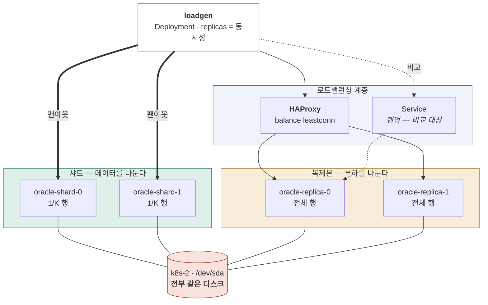

# Stage 5 — DB 수평 확장과 로드밸런싱

| | |
|---|---|
| 예상 소요 | 3~5일 |
| 선행 | [Stage 4](stage-04-workloads.md) |
| 대상 | Oracle EE + HEracles (FHE 검색 확장) |
| 기록할 곳 | `labs/stage-05-db-scaling.md` |

> 📝 계획 수준. 진입할 때 실행 절차로 확장한다.
> Oracle 버전·HEracles 설치 방식은 실제 환경을 확인한 뒤 확정한다.

## 이 단계를 마치면



**두 축을 따로 측정하고, 마지막에 공유 디스크라는 벽을 만난다.**
그 벽이 [Stage 9](stage-09-cross-host.md) 의 이유가 되고,
[Stage 10](stage-10-ha.md) 에서 두 호스트로 흩은 뒤 다시 잰다.

## 이 단계에서 하는 일

**무거운 DB 연산을 쿠버네티스로 어떻게 확장하는지 측정한다.**

[HEracles](https://cryptolab.gitbook.io/heracles) 는 동형암호(FHE)로
**암호문을 복호화하지 않고 검색**하는 DBMS 확장이다.

```sql
SELECT id FROM docs WHERE HERACLES_MATCH(enc_col, :q) = 1;
```

`HERACLES_MATCH` 는 **행마다 독립적으로** FHE 비교를 수행하고 **매칭된 row ID 만** 돌려준다.
정렬·조인·집계는 평문 SQL 이 맡는다.

이 모양이 확장 실험에 이상적이다.

| 특성 | 의미 |
|---|---|
| 행 단위 독립 연산 | **완전 병렬화 가능** (embarrassingly parallel) |
| 결과가 row ID 목록 | 샤드 간 **병합이 합집합**이면 끝 |
| 집계를 DB 에 위임 | 샤드 간 조인 비용이 생기지 않는다 |
| 읽기 전용 | **복제본에서 그대로 돌아간다** |

## ⭐ 개선 축이 둘이다

**이것을 구분하지 않으면 실험 결과를 잘못 읽는다.**

| 방식 | 데이터 배치 | **단일 쿼리 지연** | **동시 처리량** |
|---|---|---|---|
| **Parallel Query** | 전체 (1 인스턴스) | **N배 빨라짐** | 코어 경합으로 감소 |
| **샤딩** | 각 인스턴스가 1/N | **N배 빨라짐** | 그대로 |
| **읽기 복제 + LB** | 각 인스턴스가 전체 | 그대로 | **N배** |

- "검색 한 번이 30초 걸린다" → **PQ · 샤딩**
- "동시 사용자가 붙으면 다 느려진다" → **복제 + LB**
- 둘 다 → **샤드 K개 × 복제 R개**

FHE 는 단일 쿼리도 무거우므로 조합이 답일 가능성이 높다.
그러면 `K × R` 인스턴스를 **6노드에 어떻게 배치할지**가 그대로 스케줄링 실습이 된다.

## 완료 기준

- [ ] DOP 를 올리며 단일 쿼리 지연이 어떻게 줄어드는지 곡선을 얻었다
- [ ] 샤드 수를 늘리며 같은 곡선을 얻고 PQ 와 비교했다
- [ ] 복제본 + LB 로 동시 처리량이 늘어나는 것을 확인했다
- [ ] **Service(kube-proxy) 로는 DB 부하가 고르게 안 나뉜다**는 것을 수치로 확인했다
- [ ] HAProxy `leastconn` 으로 개선되는 것을 확인했다
- [ ] **선형성이 꺾이는 지점**과 그 원인(CPU·I/O·락)을 찾았다

---

## 1. 측정 환경

### 1-1. 부하 생성기도 쿠버네티스로

동시성을 `replicas` 로 조절한다. **부하를 늘리는 것이 `kubectl scale` 한 줄**이 된다.

```yaml
# 각 파드가 쿼리를 반복 실행하고 지연을 stdout 으로 남긴다
apiVersion: apps/v1
kind: Deployment
metadata: { name: loadgen }
spec:
  replicas: 1          # ← 동시성
  selector: { matchLabels: { app: loadgen } }
  template:
    metadata: { labels: { app: loadgen } }
    spec:
      containers:
        - name: loadgen
          image: ghcr.io/jeeklee/k8s-study-loadgen:<태그>
          env:
            - name: DSN
              valueFrom: { secretKeyRef: { name: oracle-conn, key: dsn } }
            - name: QUERY_FILE
              value: /q/heracles.sql
```

```bash
kubectl scale deployment loadgen --replicas=20     # 동시 20
```

> 부하 생성기를 노드 밖에 두면 네트워크가 변수로 들어온다.
> **DB 와 같은 클러스터 안에** 두되, `podAntiAffinity` 로 DB 와 다른 노드에 배치한다.

### 1-2. 무엇을 재는가

| 지표 | 어디서 |
|---|---|
| 단일 쿼리 지연 (p50·p95) | 부하 생성기 로그 |
| 처리량 (QPS) | 부하 생성기 집계 |
| **코어당 효율** | QPS ÷ 할당 코어 — **선형성 판단의 핵심** |
| 실제 DOP | `v$pq_sesstat`, `v$px_session` |
| 복제본별 쿼리 분포 | 각 인스턴스의 세션 수 |
| 디스크 | 호스트에서 `iostat -x` — `%util`, `await` |
| 컨테이너 CPU | `kubectl top` 또는 cgroup |

> **코어당 효율이 이 실험의 답이다.** 코어를 2배 줘서 2배 빨라지면 선형,
> 1.3배면 어디선가 막힌 것이다. **그 지점을 찾는 것이 목적**이다.

---

## 2. ① 스케일업 — Parallel Query

**샤딩보다 먼저 한다.** 한 인스턴스에서 워커의 12코어를 다 쓸 수 있는데
복잡도를 떠안으면 손해이기 때문이다.

```sql
-- 직렬 baseline
SELECT id FROM docs WHERE HERACLES_MATCH(enc_col, :q) = 1;

-- DOP 를 올려가며
SELECT /*+ PARALLEL(docs, 4) */ id FROM docs WHERE HERACLES_MATCH(enc_col, :q) = 1;
```

```sql
-- 실제로 병렬이 걸렸는지 확인 — 힌트를 줘도 무시될 수 있다
SELECT * FROM v$pq_sesstat WHERE statistic = 'Queries Parallelized';
SELECT degree FROM v$px_session WHERE sid = SYS_CONTEXT('USERENV','SID');
```

**DOP 1 → 2 → 4 → 8 → 12 로 올리며 지연을 기록한다.**
워커가 12 vCPU 이므로 12가 상한이다. 그 이상을 보려면 VM 을 더 키워야 한다.

파티셔닝을 더하면 파티션별 병렬 스캔이 된다.

```sql
ALTER TABLE docs PARALLEL 12;
-- 해시 파티셔닝 후 partition-wise 병렬
```

### ⚠️ `limits.cpu` 가 PQ 를 막는다

컨테이너에 `limits.cpu: 4` 를 걸면 **DOP 를 12로 줘도 4코어 분량만 돈다.**
cgroup 이 스로틀링하기 때문이다.

```bash
kubectl get pod <oracle> -o jsonpath='{.spec.containers[0].resources}'
cat /sys/fs/cgroup/.../cpu.stat        # nr_throttled 가 올라간다
```

**DOP 와 `limits.cpu` 를 함께 올려가며 재는 것**이 이 절의 핵심이다.
→ [`notes/kubernetes/resources.md`](../../notes/kubernetes/resources.md)

---

## 3. ② 스케일아웃 — 샤딩

데이터를 K개로 나누고 **모든 샤드에 같은 쿼리를 던져 row ID 를 합친다.**

`HERACLES_MATCH` 는 샤드 키로 대상을 좁힐 수 없다 — **암호문이라 어느 샤드에 있는지 모른다.**
따라서 항상 **전 샤드 팬아웃**이다. 이것이 오히려 확장에 유리하다.

```
쿼리 → ┬→ shard-0 (1/K 행 스캔) ┐
       ├→ shard-1 (1/K 행 스캔) ├→ row ID 합집합
       └→ shard-K (1/K 행 스캔) ┘
```

| 구성 | 선택지 |
|---|---|
| **Oracle Sharding** (EE) | 샤드 카탈로그·GSM 필요. 다중 샤드 쿼리를 코디네이터가 처리 |
| **애플리케이션 레벨** | 독립 인스턴스 K개 + 앱이 팬아웃·병합. **단순하고 통제하기 쉽다** |

**측정 목적이라면 애플리케이션 레벨을 권한다.** 변수가 적고
"어느 샤드가 얼마나 걸렸는지"를 직접 볼 수 있다.

쿠버네티스 쪽:

```yaml
# StatefulSet 하나에 replicas: K — 각 파드가 하나의 샤드
# 파드마다 자기 PVC 를 갖는다
volumeClaimTemplates:
  - metadata: { name: data }
    spec:
      accessModes: [ReadWriteOnce]
      resources: { requests: { storage: 100Gi } }
```

```yaml
# 샤드를 서로 다른 노드에 강제
affinity:
  podAntiAffinity:
    requiredDuringSchedulingIgnoredDuringExecution:
      - labelSelector: { matchLabels: { app: oracle-shard } }
        topologyKey: kubernetes.io/hostname
```

### 자원 배분 — 워커 2대 × 12 vCPU / 96 GiB

샤드를 늘리면 **인스턴스당 몫이 줄어든다.** 총량은 그대로다.

| 샤드 | 워커당 | 인스턴스당 `cpu` | 인스턴스당 `memory` | 비고 |
|---|---|---|---|---|
| 2 | 1개 | 12 | 32 GiB | 노드를 독점 |
| 4 | 2개 | 6 | 32 GiB | |
| 6 | 3개 | 4 | 24 GiB | SGA 가 작아진다 |
| 8 | 4개 | 3 | 16 GiB | **SGA 가 너무 작아 비교가 무의미해질 수 있다** |

> ⭐ **여기에 이 실험의 함정이 있다.** 샤드를 늘리면 데이터는 1/N 로 줄지만
> **인스턴스당 자원도 1/N 로 준다.** 총 자원이 고정된 상태에서 나누는 것이므로,
> 순수한 "확장 효과"가 아니라 **분할 효과**를 보는 것이다.
>
> 진짜 스케일아웃은 **자원을 추가**할 때 나온다 —
> 그것이 [Stage 9](stage-09-cross-host.md) 에서 k8s-1 의 워커가 합류하는 의미다.
> Stage 5 에서는 **"나눠도 손해가 없는가"** 를 본다.

**샤드 2 → 4 → 6 으로 늘리며 지연을 기록하고 ②의 PQ 곡선과 겹쳐 본다.**

---

## 4. ③ 복제 + 로드밸런싱

HEracles 검색은 **읽기 전용**이라 복제본에서 그대로 돌아간다.

| 방식 | 비고 |
|---|---|
| **Active Data Guard** | EE + ADG 옵션. 물리 스탠바이를 읽기 전용으로 연다 |
| 단순 복사본 | 데이터가 정적이면 같은 데이터를 넣은 독립 인스턴스로도 실험 가능 |

**측정만이 목적이면 후자로 시작해도 된다.** 복제 지연이 변수로 들어오지 않아 더 깨끗하다.

### 4-1. Service 로 앞단을 만들면 — 잘 안 된다

```yaml
apiVersion: v1
kind: Service
metadata: { name: oracle-read }
spec:
  selector: { app: oracle-replica }
  ports: [{ port: 1521 }]
```

동시 20으로 부하를 주고 **복제본별 세션 수**를 세어본다.

```sql
SELECT COUNT(*) FROM v$session WHERE username = 'APP';
```

**고르게 나뉘지 않는다.**

```
Service(ClusterIP) → kube-proxy → iptables 랜덤 분배
                                   ↑ 연결을 맺는 순간에만 분배한다
```

DB 커넥션 풀은 **한번 붙으면 계속 쓴다.** 연결 20개가 우연히
복제본 1번에 14개, 2번에 6개로 붙으면 **그 불균형이 끝까지 간다.**
kube-proxy 는 부하도 연결 수도 보지 않는다.

> Stage 4 에서 "Service 가 로드밸런싱한다"를 배웠는데,
> **긴 연결에서는 그 전제가 깨진다.** 이것을 수치로 확인하는 것이 이 절의 핵심이다.

### 4-2. 단계를 올린다

| 방식 | 분배 기준 | 한계 |
|---|---|---|
| Service (kube-proxy) | **랜덤** | 연결 시점에만. 부하를 모름 |
| **HAProxy `leastconn`** | **연결 수** | control plane 앞에 이미 쓰고 있다 |
| HAProxy + 가중치·헬스체크 | 응답 시간 | 설정이 복잡 |
| Oracle FAN / RLB | **DB 가 알려주는 실제 부하** | ADG·서비스 구성 필요 |
| 앱 레벨 (headless + 직접 선택) | 원하는 무엇이든 | 앱이 책임진다 |

```haproxy
listen oracle-read
    bind 0.0.0.0:1521
    mode tcp
    balance leastconn          # ← 랜덤이 아니라 연결 수 기준
    option tcp-check
    server r1 oracle-replica-0.oracle:1521 check
    server r2 oracle-replica-1.oracle:1521 check
```

**같은 부하로 다시 재고 분포 편차를 비교한다.**
`:8404/stats` 에서 서버별 현재 세션 수가 실시간으로 보인다.

> 커넥션 풀을 쓰면 `leastconn` 도 완벽하지 않다.
> **연결 수는 고른데 쿼리 부하가 다를 수 있다.**
> 거기서 더 가려면 앱 레벨이나 Oracle RLB 가 필요하다 — 그 한계까지 확인한다.

---

## 5. 선형성이 꺾이는 지점을 찾는다

**이 단계의 진짜 결과물이다.**

```
코어당 QPS
   │
   │───────╮                   ← 선형 구간
   │        ╰──╮               ← 꺾임
   │            ╰────────      ← 포화
   └────────────────────────▶  할당 코어
```

꺾이는 원인 후보:

| 원인 | 확인 |
|---|---|
| **디스크 I/O** | 호스트 `iostat -x` 의 `%util`, `await` |
| CPU 스로틀링 | cgroup `cpu.stat` 의 `nr_throttled` |
| Oracle 대기 이벤트 | `v$session_wait`, AWR |
| PQ 프로세스 한계 | `parallel_max_servers` |
| 네트워크 | 샤드 팬아웃의 결과 전송량 |

### ⚠️ 이 단계에서는 I/O 에서 막힐 가능성이 높다

**FHE 암호문은 원본보다 수십~수백 배 크다.** 풀스캔이면 읽을 바이트가 그만큼 늘어난다.

그런데 **지금은 모든 샤드·복제본이 k8s-2 한 대의 같은 디스크(`/dev/sda`)를 공유한다.**
CPU 를 늘려도 디스크에서 막히면 확장이 멈춘다.

```bash
# 호스트에서 — 부하 중에
iostat -x 2 /dev/sda
```

**여기서 I/O 벽을 만나는 것이 정상이고, 그것이 Stage 9 의 이유가 된다.**

```
Stage 5   한 호스트에서 측정 → I/O 벽
             ↓
Stage 9   크로스 호스트 — 두 호스트에 디스크가 분리된다
             ↓
Stage 10  HA 완성 후 재측정 → 개선 폭 확인
```

---

## 6. 쿠버네티스 쪽에서 배우는 것

| 주제 | 이 실험에서 |
|---|---|
| **StatefulSet + PVC** | 샤드마다 자기 저장소. **노드에 묶이는 제약**을 정면으로 겪는다 |
| **`podAntiAffinity`** | 샤드를 서로 다른 노드에 강제 |
| **`requests`/`limits`** | `limits.cpu` 가 DOP 를 무력화하는 것 |
| **QoS** | DB 를 `Guaranteed` 로 두어 축출에서 보호 |
| **Service 의 한계** | 긴 연결에서 L4 분배가 깨지는 것 |
| **HAProxy** | control plane 앞과 같은 도구를 DB 앞에도 |
| `kubectl scale` | 부하 생성기의 동시성 조절 |

---

## 준비물

| 항목 | 확인 |
|---|---|
| Oracle EE 라이선스 범위 | **컨테이너는 호스트 전체 코어 기준**이 일반적. k8s-1(16) + k8s-2(32) = 48코어가 대상이 될 수 있다 |
| HEracles 배포 방식 | 커스텀 이미지에 포함 vs initContainer 설치 |
| 데이터셋 | 행 수·암호문 크기. **풀스캔 시간이 측정 가능한 범위**여야 한다 |
| 노드 자원 | 워커 12 vCPU / 96 GiB / 데이터 디스크 500 GB — [Stage 4 §0](stage-04-workloads.md) 에서 확장 |
| 부하 생성기 이미지 | `apps/loadgen` 으로 추가 예정 |

## 자주 막히는 곳

| 증상 | 확인 |
|---|---|
| DOP 를 올려도 안 빨라짐 | `v$pq_sesstat` — 힌트가 무시됐거나 `limits.cpu` 스로틀링 |
| 샤드를 늘려도 안 빨라짐 | `iostat` — 같은 디스크를 공유하고 있다 |
| 복제본에 부하가 몰림 | Service 의 랜덤 분배. 연결 수를 직접 세어볼 것 |
| PVC 가 `Pending` | local-path 는 노드에 묶인다. `podAntiAffinity` 와 충돌하지 않는지 |
| DB 파드가 축출됨 | QoS 가 `Guaranteed` 인가 |

관련: [`notes/kubernetes/resources.md`](../../notes/kubernetes/resources.md) ·
[`notes/infra/haproxy.md`](../../notes/infra/haproxy.md) ·
[`notes/kubernetes/scheduler.md`](../../notes/kubernetes/scheduler.md)

---

다음: [Stage 6 — 스테이트리스 앱과 외부 노출](stage-06-stateless-apps.md)
