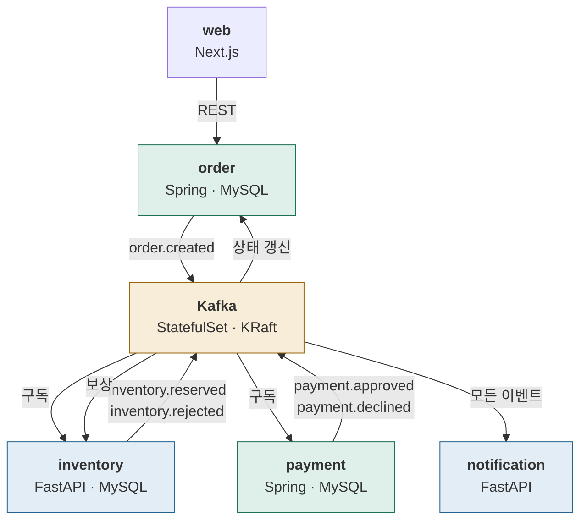

# Stage 6 — 이벤트 기반 MSA

| | |
|---|---|
| 예상 소요 | 3~5일 |
| 선행 | [Stage 5](stage-05-data-layer.md) |
| 앱 | Kafka + `order`·`payment`·`inventory`·`notification`·`web` |
| 기록할 곳 | `labs/stage-06-event-driven.md` |

> 📝 계획 수준. 진입할 때 실행 절차로 확장한다.

## 이 단계를 마치면



**서비스들이 서로를 직접 부르지 않는다.** 이벤트로만 대화한다.

설계는 [`apps/README.md`](../../apps/README.md).

## 완료 기준

- [ ] Kafka 가 StatefulSet 으로 뜨고 파드를 지워도 데이터가 남는다
- [ ] 주문 → 재고 예약 → 결제 승인 → CONFIRMED 가 끝까지 흐른다
- [ ] **결제를 실패시키면 재고가 복원되고 주문이 CANCELLED 된다** (보상)
- [ ] 컨슈머를 재시작해 **중복 처리가 일어나는 것을 확인**하고, 멱등성으로 막는다
- [ ] Strimzi 오퍼레이터로 갈아탄다

## 다룰 것

### Kafka 를 두 번 올린다

| 방식 | 배우는 것 |
|---|---|
| **직접 StatefulSet** | KRaft 모드, headless Service, 브로커 ID 와 안정적 네트워크 ID, PVC |
| **Strimzi 오퍼레이터** | 실무 표준. **CRD·오퍼레이터 패턴** (CKA 범위) |

**직접 한 번 올려봐야 오퍼레이터가 무엇을 대신 해주는지 안다.**

> KRaft 모드는 ZooKeeper 가 필요 없다. 예전 자료는 대부분 ZooKeeper 기준이므로
> 그대로 따라 하면 안 된다.

### headless Service

```yaml
spec:
  clusterIP: None        # ← headless
```

일반 Service 는 **하나의 가상 IP**로 묶어 로드밸런싱한다.
Kafka 는 **브로커 각각에 직접 붙어야** 하므로 그러면 안 된다.

headless 는 DNS 조회 시 **파드 IP 목록을 그대로** 돌려준다.
`kafka-0.kafka.default.svc.cluster.local` 처럼 파드마다 이름이 생긴다.

### Spring Boot 가 들어온다 — JVM 특유의 문제

| 문제 | 대응 |
|---|---|
| 기동이 10초 이상 | **`startupProbe`** — 성공할 때까지 liveness 를 막는다 |
| 컨테이너 메모리 제한을 JVM 이 모름 | `-XX:MaxRAMPercentage` |
| 이미지가 400MB | 멀티 스테이지, jlink, distroless |

**FastAPI 에서는 겪지 않던 것들**이라 비교가 선명하다.

### 멱등성 — 일부러 빠뜨린다

Kafka 는 **at-least-once** 다. 같은 이벤트를 두 번 받을 수 있다.

1. 멱등성 없이 컨슈머를 돌린다
2. 처리 도중 파드를 죽인다
3. **재고가 두 번 차감되는 것을 확인한다**
4. `processed_events` 테이블로 막는다

**직접 깨뜨려봐야 왜 필요한지 안다.**

### 컨슈머 그룹과 파티션

- 파티션 수 > 컨슈머 수 → 일부 컨슈머가 여러 파티션 담당
- 파티션 수 < 컨슈머 수 → **남는 컨슈머는 논다**
- 파드를 늘렸는데 처리량이 안 오르면 파티션 수를 본다

`replicas` 를 바꿔가며 리밸런싱을 관찰한다.

## 자주 막히는 곳

| 증상 | 확인 |
|---|---|
| 브로커에 못 붙음 | `advertised.listeners` — 파드 DNS 이름이어야 한다 |
| 컨슈머가 메시지를 못 받음 | 컨슈머 그룹 오프셋, 파티션 할당 |
| Spring 파드가 계속 재시작 | `startupProbe` 없이 liveness 가 먼저 걸린 것 |
| OOMKilled | JVM 힙이 컨테이너 제한을 모름 |
