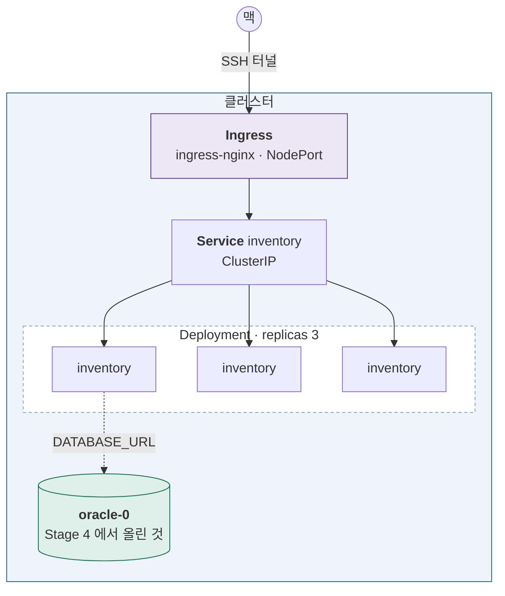

# Stage 6 — 스테이트리스 앱과 외부 노출

| | |
|---|---|
| 예상 소요 | 1~2일 |
| 선행 | [Stage 5](stage-05-db-scaling.md) |
| 앱 | [`apps/inventory`](../../apps/inventory/) (FastAPI) · [`apps/web`](../../apps/web/) (Next.js) |
| 기록할 곳 | `labs/stage-06-stateless-apps.md` |

> 📝 계획 수준. 진입할 때 실행 절차로 확장한다.

## 이 단계에서 하는 일

Stage 4~5 는 **상태를 가진 워크로드**를 다뤘다. 여기서는 반대편이다.

| | Stage 4 (Oracle) | Stage 6 (앱) |
|---|---|---|
| 컨트롤러 | StatefulSet | **Deployment** |
| 파드 이름 | 고정 `oracle-0` | 무작위, 매번 바뀜 |
| 저장소 | PVC 필수 | 없음 |
| 교체 | 신중하게, 한 번에 하나 | **무중단 롤링 업데이트** |
| 노출 | 클러스터 내부만 | **Ingress 로 밖에서** |

**상태가 없으면 운영이 완전히 달라진다.** 그 차이를 직접 겪는 것이 목적이다.

## 이 단계를 마치면



## 완료 기준

- [ ] `inventory` 가 Deployment 로 3 replica 뜬다
- [ ] Service 로 **부르는 파드가 매번 바뀐다** (로드밸런싱 확인)
- [ ] **readiness 를 실패시키면 그 파드만 Endpoints 에서 빠진다**
- [ ] 새 태그로 **무중단 롤링 업데이트**가 된다
- [ ] `rollout undo` 로 되돌아간다
- [ ] 맥 브라우저에서 서비스가 열린다
- [ ] `DATABASE_URL` 만 바꿔 **Stage 4 의 Oracle 에 붙는다**

---

## 1. Deployment — StatefulSet 과 비교하며

Stage 4 에서 StatefulSet 을 썼으니 차이가 바로 보인다.

```bash
kubectl apply -f apps/manifests/inventory-deploy.yaml
kubectl get pods -o wide
```

```
inventory-7d8f9c-x9k2      ← 무작위 이름
inventory-7d8f9c-p4m1
inventory-7d8f9c-t2b8
```

`oracle-0` 처럼 번호가 붙지 않는다. **누가 몇 번인지 중요하지 않기 때문**이다.

```
Deployment  ──관리──▶  ReplicaSet  ──관리──▶  Pod
   (버전)                 (개수)              (실행)
```

이 세 층이 롤링 업데이트의 구조다. **새 버전은 새 ReplicaSet 을 만들고,
옛 ReplicaSet 을 0으로 줄인다.** 그래서 되돌리기가 가능하다.

## 2. Service 와 로드밸런싱

Stage 4 에서는 headless 를 썼다. 여기서는 **일반 ClusterIP** 다.

```bash
kubectl expose deployment inventory --port=80 --target-port=8000
```

```bash
kubectl run -it --rm dbg --image=curlimages/curl:8.11.1 --restart=Never -- \
  sh -c 'for i in $(seq 10); do curl -s inventory | grep -o "\"pod\":\"[^\"]*\""; done'
```

**응답하는 파드 이름이 바뀌면 성공이다.**

> Stage 5 에서 **DB 커넥션에서는 이 분배가 깨지는 것**을 봤다.
> HTTP 는 요청마다 연결이 끝나(또는 keep-alive 가 짧아) 잘 나뉘지만,
> DB 커넥션 풀은 한번 붙으면 계속 쓴다. **같은 Service 인데 결과가 다르다.**

### readiness 로 빼보기

```bash
kubectl get endpoints inventory      # 주소 3개
# (파드 하나를 readiness 실패 상태로)
kubectl get endpoints inventory      # 주소 2개
```

**Service 가 무엇을 보고 라우팅하는지**가 드러난다 — 파드가 아니라 **Endpoints** 다.

## 3. 롤링 업데이트와 롤백

```bash
kubectl set image deployment/inventory \
  inventory=ghcr.io/jeeklee/k8s-study-inventory:<새태그>

kubectl rollout status deployment/inventory
kubectl get pods -w                    # 하나씩 교체되는 것을 본다
```

```bash
kubectl rollout history deployment/inventory
kubectl rollout undo deployment/inventory              # 직전으로
kubectl rollout undo deployment/inventory --to-revision=2
```

**무중단으로 교체되는 이유**는 `readinessProbe` 때문이다.
새 파드가 준비될 때까지 Service 에 들어가지 않고, 그동안 옛 파드가 트래픽을 받는다.

```yaml
  strategy:
    rollingUpdate:
      maxUnavailable: 0      # 줄이지 않는다
      maxSurge: 1            # 하나씩 더 만들어 교체
```

> **`readinessProbe` 가 없으면 무중단이 아니다.** 컨테이너가 뜨자마자
> 준비된 것으로 보고 트래픽을 보내기 때문이다.

> ⚠️ **StatefulSet 은 이렇게 못 한다.** 순서대로, 한 번에 하나씩 교체한다.
> Stage 4 의 Oracle 을 같은 방식으로 바꾸려 하면 왜 안 되는지 생각해볼 것.

## 4. Ingress — 밖에서 열기

### 4-1. Ingress Controller 설치

**Ingress 리소스만 만들면 아무 일도 일어나지 않는다.**
그것을 읽고 실제로 처리하는 컨트롤러가 필요하다.

```bash
kubectl apply -f https://raw.githubusercontent.com/kubernetes/ingress-nginx/controller-v1.13.3/deploy/static/provider/baremetal/deploy.yaml
kubectl -n ingress-nginx get pods
kubectl -n ingress-nginx get svc
```

`baremetal` 판을 쓰는 이유는 **클라우드 LB 가 없기 때문**이다. NodePort 로 노출된다.

### 4-2. Ingress 작성

```yaml
apiVersion: networking.k8s.io/v1
kind: Ingress
metadata:
  name: inventory
spec:
  ingressClassName: nginx
  rules:
    - host: inventory.local
      http:
        paths:
          - path: /
            pathType: Prefix
            backend:
              service:
                name: inventory
                port: { number: 80 }
```

### 4-3. 맥에서 열어보기

VM 네트워크는 k8s-2 안에만 있으므로 터널을 판다.

```bash
kubectl -n ingress-nginx get svc ingress-nginx-controller     # NodePort 확인

# 맥에서
ssh -L 8080:192.168.122.21:<NodePort> k8s-2
curl -H 'Host: inventory.local' localhost:8080
```

> **Ingress vs Gateway API**
> Ingress 는 오래됐고 기능 확장이 어노테이션에 몰려 벤더마다 다르다.
> **Gateway API** 가 후계로, 역할 분리(인프라팀 ↔ 앱팀)가 명확하다.
> CKA v1.35 범위에 포함되므로 [Stage 11](stage-11-cka-domains.md) 에서 다시 본다.

## 5. ⭐ 설정만 바꿔 데이터 계층에 붙인다

`inventory` 는 **`DATABASE_URL` 하나로 동작이 갈리게** 만들어뒀다.

| `DATABASE_URL` | 동작 |
|---|---|
| 비어 있음 | 메모리에 저장 |
| 값이 있음 | **DB 에 저장** |

```bash
kubectl create configmap inventory-config \
  --from-literal=DATABASE_URL='<Stage 4 에서 만든 DSN>'

kubectl rollout restart deployment inventory
```

**이미지는 그대로다.** 재빌드도, 코드 수정도 없다.

> 12-factor 의 "설정을 코드에서 분리한다"가 이 한 줄로 증명된다.
> 같은 이미지가 개발·스테이징·운영에서 다르게 동작하는 것이 이 원리다.

```bash
kubectl exec deploy/inventory -- env | grep DATABASE_URL
```

> **`env` 로 주입한 값은 파드를 다시 만들어야 반영된다.** `rollout restart` 가 필요한 이유다.
> 볼륨으로 마운트하면 파일은 갱신되지만 **앱이 다시 읽어야** 한다.

## 6. 검증과 기록

```bash
kubectl get all
kubectl get pods -o wide          # 워커에 분산됐는가
kubectl get endpoints inventory
kubectl rollout history deployment/inventory
```

> Ingress Controller 는 남겨둔다. Stage 7 에서 계속 쓴다.

---

## 자주 막히는 곳

| 증상 | 확인 |
|---|---|
| `ImagePullBackOff` | `imagePullSecret`. Stage 4 에서 만든 것을 그대로 쓴다 |
| 롤링 업데이트가 멈춤 | 새 파드가 readiness 를 통과 못 함. `describe` 로 확인 |
| 업데이트 중 502 | `readinessProbe` 가 없거나 `maxUnavailable` 이 0이 아니다 |
| Ingress 가 404 | `ingressClassName`, `Host` 헤더, Service 이름·포트 |
| Ingress 가 503 | 뒤의 Service Endpoints 가 비었다 |
| `DATABASE_URL` 이 안 먹음 | `rollout restart` 했는가. `env` 는 재생성이 필요하다 |

---

다음: [Stage 7 — 이벤트 기반 MSA](stage-07-event-driven.md)
