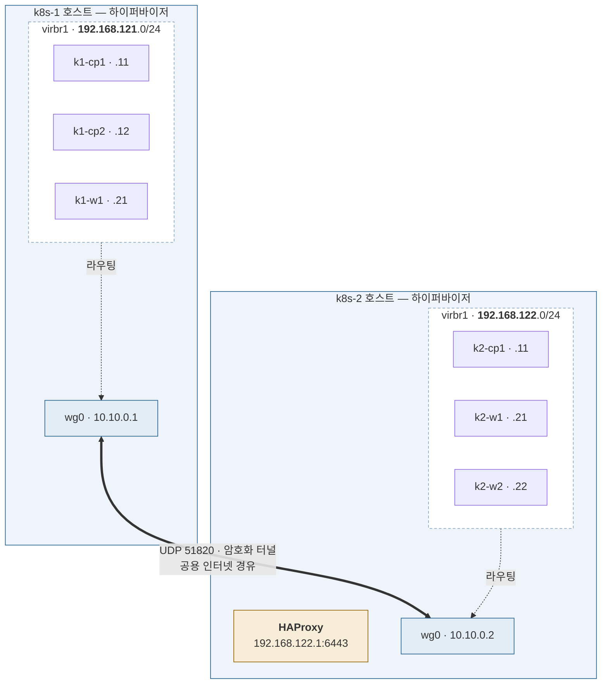

# Stage 8 — 크로스 호스트 라우팅

| | |
|---|---|
| 대상 | k8s-1 + k8s-2 |
| 예상 소요 | 하루 |
| 선행 | [Stage 7](stage-07-scheduling-ops.md) |
| 기록할 곳 | `labs/stage-08-cross-host.md` |

> 📝 계획 수준. 진입 시 확장한다.

## 목표

두 호스트의 VM이 하나의 사설망처럼 통신한다.

> **앱이 이미 돌고 있는 상태에서 한다.** Stage 4~7 에서 올린 워크로드가
> 터널을 깔고 노드를 추가한 뒤에도 정상 동작하는지가 이 단계의 진짜 검증이다.
> 특히 MTU 문제는 **파드 간 통신이 깨지는 형태**로 나타나므로
> 빈 클러스터에서는 발견조차 못 한다.
**Stage 0에서 정리한 개념이 전부 쓰인다.** 가장 어렵고 가장 배울 것이 많다.

핵심: **VM들은 터널의 존재를 모른다.** 호스트끼리만 연결하고
각자의 VM 대역을 서로에게 라우팅해준다.

## 이 단계를 마치면



**두 호스트의 VM이 하나의 사설망처럼 통신한다.**

핵심은 **VM들이 터널의 존재를 모른다**는 것이다.
`k1-cp1`은 그냥 `192.168.122.21`로 보내고, 호스트가 라우터로서 터널에 태운다.
그래서 VM 쪽 설정은 Stage 3과 똑같다.

| 추가된 것 | 어디에 |
|---|---|
| OCI 보안 목록 `udp/51820` (양쪽 VCN) | 클라우드 |
| WireGuard 터널 (`wg0`, `MTU 1420`) | 호스트 2대 |
| `AllowedIPs`에 상대 VM 대역 | 호스트 2대 |
| `FORWARD` 규칙 (`virbr1` ↔ `wg0`) | 호스트 2대 |
| libvirt + VM 3대 (`192.168.121.x`) | k8s-1 |
| 클러스터 합류 | k1-* 3대 |

> ⚠️ `wg0`의 MTU를 **명시**해야 한다. 이 환경의 `ens3`는 9000이라
> `wg-quick`이 자동 계산하면 8920을 잡는데, 공용 인터넷 경로는 1500이다.

## 완료 기준

- [ ] `k1-cp1`(192.168.121.11)에서 `k2-w1`(192.168.122.21)로 ping
- [ ] 두 호스트의 VM이 한 클러스터에서 `Ready`
- [ ] 큰 패킷 테스트 통과 — `ping -c3 -M do -s 1372 <상대VM>`

## 할 일

### ① Stage 0에서 이월된 검증

OCI 보안 목록에 UDP 51820 인그레스 (양쪽 VCN, 소스는 상대 공인 IP `/32`).
그리고 [`notes/network/README.md`](../../notes/network/README.md#phase-0-연결성-점검-절차) 3·4단계로 양방향 통과 확인.

### ② 호스트 간 WireGuard

`AllowedIPs`에 **상대 VM 대역까지** 넣는 것이 핵심이다.

```ini
[Interface]
MTU = 1420                 # ← 자동 계산에 맡기지 말 것. 아래 참고

# k8s-1 쪽 [Peer]
AllowedIPs = 10.10.0.0/24, 192.168.122.0/24
# k8s-2 쪽 [Peer]
AllowedIPs = 10.10.0.0/24, 192.168.121.0/24
```

> ⚠️ **`MTU`를 반드시 명시한다.**
> 이 환경의 `ens3` MTU는 **9000**(점보 프레임)이다.
> `wg-quick`은 `MTU`가 없으면 경로 MTU에서 80을 빼 자동으로 정하므로
> **8920을 잡을 수 있다.** 공용 인터넷 경로는 보통 1500이라
> 그 크기의 패킷은 중간에서 조용히 버려진다.

### ③ 호스트를 라우터로

```bash
sudo iptables -A FORWARD -i virbr1 -o wg0 -j ACCEPT
sudo iptables -A FORWARD -i wg0 -o virbr1 -j ACCEPT
```

`ip_forward`와 인터넷용 MASQUERADE는 Stage 1에서 이미 걸었다.
**`wg0`로 나가는 트래픽에는 NAT을 걸지 않는다** — 출발지 주소가 보존돼야 한다.

### ④ k8s-1에 VM 구성

Stage 1과 동일하되 대역만 `192.168.121.0/24`. VM 3대 생성 후 `kubeadm join`.

## ⚠️ MTU — 이 단계의 진짜 함정

```
ens3            9000   ← VCN 내부용 점보 프레임 (실측)
 └ 인터넷 경로   1500   ← 실제 제약은 여기
    └ wg0        1420   (WireGuard 오버헤드 80)
       └ VXLAN   1370   ← 파드 MTU
```

`virbr1`이 1500인 것도 함께 점검한다. VM은 1500으로 보내는데 터널은 1420이라
그 사이에서 조각화가 필요해진다.

맞추지 않으면 **작은 요청은 되는데 큰 응답만 멈춘다.**
이미지 pull이나 큰 API 응답이 타임아웃되는 식이라 원인 찾기가 매우 어렵다.
Stage 2에서 미리 1370으로 잡아둔 이유다.

다음: [Stage 9 — HA control plane](stage-09-ha.md)
