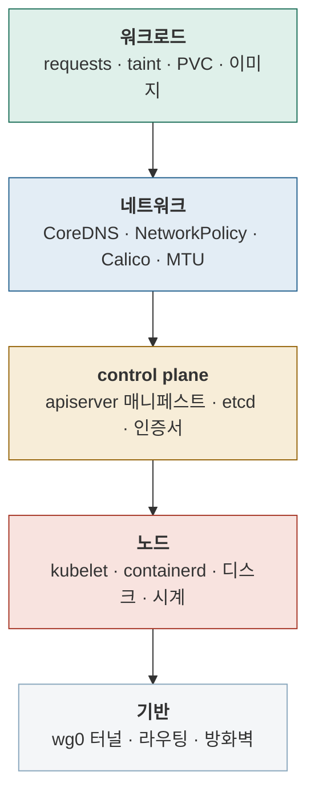

# Stage 10 — CKA 영역별 실습

| | |
|---|---|
| 예상 소요 | 3–5주 |
| 선행 | [Stage 9](stage-09-ha.md) |
| 기록할 곳 | [`labs/drills/`](../../labs/drills/) |

> 📝 계획 수준. 진입 시 확장한다.

## 무엇을 망가뜨리는가

구성은 바뀌지 않는다. **계층마다 고장을 주입하고 복구하는 것**이 이 단계다.

**아래로 갈수록 영향 범위가 크고 복구가 어렵다.**
진단은 반대로 **위에서 증상을 보고 아래로 내려가며** 좁힌다.

> 스냅샷을 먼저 찍는다. 부수는 데 드는 비용이 0이 되어야 훈련이 반복된다.
> 훈련 목록은 [`labs/drills/README.md`](../../labs/drills/README.md)에 20여 개 준비돼 있다.

## 목표

시험 범위를 클러스터 위에서 전부 손으로 해본다.

Stage 1–9를 지나면 Cluster Architecture 영역(25%)은 이미 상당 부분 몸에 남아 있다.
남은 것을 **배점 순**으로 채운다.

| 영역 | 배점 | 할 것 |
|---|---:|---|
| **Troubleshooting** | 30% | kubelet 정지, 인증서 만료 조작, CNI 훼손, wg0 다운, etcd 복구. **스냅샷을 찍고 마음껏 부순다** — Stage 1의 존재 이유 |
| Cluster Architecture, Install & Config | 25% | 대부분 완료. 추가로 RBAC, `kubeadm upgrade`, Helm·Kustomize, CRD·오퍼레이터 |
| Services & Networking | 20% | Calico NetworkPolicy, CoreDNS, Ingress, Gateway API |
| Workloads & Scheduling | 15% | Stage 3에서 시작한 것을 심화. taint/toleration, affinity, HPA |
| Storage | 10% | StorageClass, PV/PVC, 동적 프로비저닝 |

훈련 목록은 [`labs/drills/README.md`](../../labs/drills/README.md)에 20여 개 준비해뒀다.
**시간을 재고** 기록한다.

## 완료 기준

- [ ] 각 영역의 대표 작업을 문서 없이 수행할 수 있다
- [ ] 막힌 것이 `labs/`에 기록되어 있다

다음: [Stage 11 — 시험 대비 마무리](stage-11-exam-prep.md)
