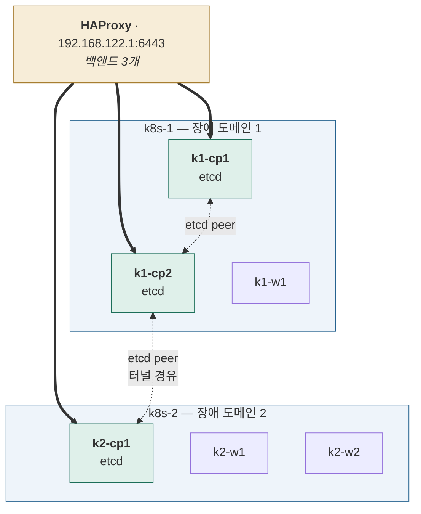

# Stage 10 — HA control plane

| | |
|---|---|
| 대상 | 6노드 완성 |
| 예상 소요 | 하루 |
| 선행 | [Stage 9](stage-09-cross-host.md) |
| 기록할 곳 | `labs/stage-10-ha.md` |

> 📝 계획 수준. 진입 시 확장한다.

## 목표

control plane 3대로 쿼럼을 만들고 **직접 깨뜨려본다.**

## 이 단계를 마치면



**6노드 · control plane 3대 · etcd 쿼럼 3.**

| 죽는 쪽 | 남는 etcd | 쿼럼(2 필요) | 결과 |
|---|---:|---|---|
| k8s-2 (CP 1대) | 2 | ✅ | 생존 |
| **k8s-1 (CP 2대)** | 1 | ❌ | **정지** |

**HA 는 절반만 된다.** 호스트가 2개라 3멤버를 2+1로 나눌 수밖에 없다.
진짜 HA는 장애 도메인이 3개여야 한다 — **이 한계를 직접 겪는 것이 쿼럼을 이해하는 가장 좋은 방법이다.**

| 추가된 것 | 어디에 |
|---|---|
| control plane 합류 (`--control-plane`) | k1-cp1, k1-cp2 |
| etcd 멤버 2개 | 위 두 노드 |
| HAProxy 백엔드 2개 추가 | 호스트 (k8s-2) |
| 스냅샷 `stage5-done` | VM 6대 |

## 완료 기준

- [ ] 6노드가 `Ready`
- [ ] 쿼럼 실험 완료 (CP 1대 정지 → 생존 / 2대 정지 → 정지)
- [ ] etcd 스냅샷에서 클러스터를 복구해봤다

## 할 일

```bash
sudo kubeadm join <endpoint>:6443 --token ... \
  --discovery-token-ca-cert-hash ... \
  --control-plane --certificate-key ...
```

- etcd 멤버 확인 — `etcdctl member list`
- **쿼럼 실험** — 직접 죽여보고 확인
- etcd 스냅샷 백업 → 오브젝트 삭제 → 복구. **CKA 단골 문제**
- 인증서 만료일 확인과 갱신 — `kubeadm certs check-expiration`

## ⚠️ HA는 절반만 된다

호스트가 2개라 etcd 3멤버를 2+1로 나눌 수밖에 없다.

| 죽는 쪽 | 남는 멤버 | 쿼럼(2 필요) | 결과 |
|---|---|---|---|
| CP 1대가 있는 호스트 | 2 | ✅ | 생존 |
| CP 2대가 있는 호스트 | 1 | ❌ | **정지** |

진짜 HA는 장애 도메인이 3개여야 한다.
**이 한계를 직접 겪는 것이 쿼럼을 이해하는 가장 좋은 방법이다.**

## 마지막에 — Stage 5 를 다시 측정한다

**6노드가 완성된 지금이 [Stage 5](stage-05-db-scaling.md) 의 한계를 풀 수 있는 시점이다.**

Stage 5 에서는 샤드·복제본이 전부 k8s-2 한 대에 있어
**같은 디스크(`/dev/sda`)를 공유**했다. FHE 암호문이 커서 풀스캔이 I/O 를 때리면
코어를 늘려도 확장이 멈춘다 — 거기서 곡선이 꺾였을 것이다.

이제 두 호스트에 흩을 수 있다. **디스크가 물리적으로 분리된다.**

```
k8s-1  ─ 디스크 A ─ shard-0, shard-1, replica-0
k8s-2  ─ 디스크 B ─ shard-2, shard-3, replica-1
```

```yaml
# 호스트 단위로 흩는다 — 노드가 아니라 장애 도메인 기준
topologySpreadConstraints:
  - maxSkew: 1
    topologyKey: topology.kubernetes.io/zone   # 호스트별로 라벨을 붙여둔다
    whenUnsatisfiable: DoNotSchedule
    labelSelector: { matchLabels: { app: oracle-shard } }
```

> 노드에 호스트를 나타내는 라벨이 없으면 먼저 붙인다.
> `kubectl label node k1-w1 topology.kubernetes.io/zone=k8s-1`

**같은 부하로 다시 재고 Stage 5 의 곡선과 겹쳐 본다.**

| 확인 | 기대 |
|---|---|
| 꺾이던 지점이 뒤로 밀렸는가 | 디스크가 분리됐으니 I/O 여유가 2배 |
| 호스트별 `iostat %util` | 한쪽에 몰려 있지 않은가 |
| **새 병목은 무엇인가** | WireGuard 터널 대역폭·MTU 일 수 있다 |

> ⚠️ **이제 샤드 팬아웃이 터널을 넘는다.** 결과가 row ID 목록이라 전송량은 작지만,
> 지연은 늘어난다. **개선폭이 기대보다 작다면 터널 왕복을 의심**한다.
> → [Stage 9](stage-09-cross-host.md) 의 MTU·대역폭 측정값과 대조

---

다음: [Stage 11 — CKA 영역별 실습](stage-11-cka-domains.md)
